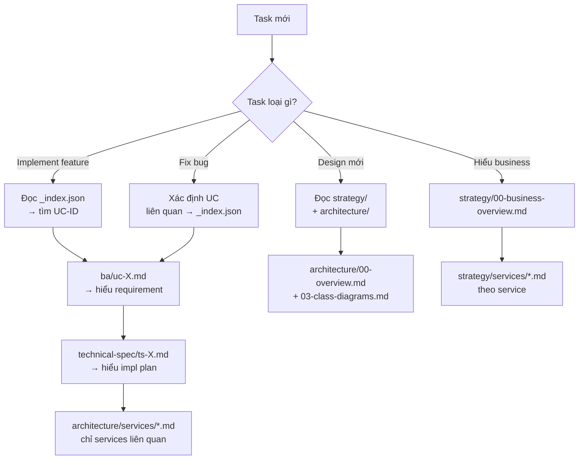

# E-commerce Tech Store — Documentation Index

## Tóm tắt
Bộ tài liệu cho dự án TMĐT microservice bán đồ công nghệ (điện thoại, đồng hồ, laptop). Tổ chức theo 4 lớp: **strategy** (WHY) → **ba** (WHAT) → **architecture** (HOW high-level) → **technical-spec** (HOW code-level). File `_index.json` là map machine-readable để AI navigate nhanh.

## Context Links
- Machine-readable map: [_index.json](./_index.json)
- CLAUDE template: [CLAUDE.md.template](./CLAUDE.md.template)

## Cấu trúc tài liệu

```
docs-ecommerce-template/
├── README.md                        # File này — entry point
├── _index.json                      # Map cho AI: UC → BA file → TS file → services
├── CLAUDE.md.template               # Template CLAUDE.md cho dự án
│
├── strategy/                        # WHY — Business strategy
│   ├── 00-business-overview.md     # Vision, value prop, KPIs
│   ├── 01-user-journeys.md         # Customer + Admin journey
│   ├── 02-business-rules.md        # Pricing, inventory, order state, refund
│   └── services/
│       ├── user-business.md
│       ├── product-business.md
│       └── order-business.md
│
├── ba/                              # WHAT — Use cases chi tiết
│   ├── README.md                    # Use case index
│   ├── uc-auth.md                   # Register, Login, Logout, Reset password
│   ├── uc-user-profile.md           # Profile + Address book
│   ├── uc-product-browse.md         # Catalog, search, filter, detail
│   ├── uc-product-review.md         # Review + Rating
│   ├── uc-cart.md                   # Cart management
│   ├── uc-checkout-payment.md       # Checkout + VNPay/COD
│   ├── uc-order-tracking.md         # Order history, tracking, cancel
│   ├── uc-admin-product.md          # Admin: Product CRUD, stock, category
│   ├── uc-admin-order.md            # Admin: View/Update order status
│   └── uc-admin-user.md             # Admin: View/Block user
│
├── architecture/                    # HOW — Technical architecture
│   ├── 00-overview.md               # HLD: context, service boundary
│   ├── 01-tech-stack.md             # Stack + version + rationale
│   ├── 02-sequence-diagrams.md      # 7 critical flows
│   ├── 03-class-diagrams.md         # Domain model per service
│   ├── frontend.md                  # NextJS architecture
│   └── services/
│       ├── user-service.md
│       ├── product-service.md
│       └── order-service.md
│
└── technical-spec/                  # HOW — Implementation plan
    ├── README.md                    # TS index
    ├── ts-auth.md
    ├── ts-user-profile.md
    ├── ts-product-browse.md
    ├── ts-product-review.md
    ├── ts-cart.md
    ├── ts-checkout-payment.md
    ├── ts-order-tracking.md
    ├── ts-admin-product.md
    ├── ts-admin-order.md
    └── ts-admin-user.md
```

## Decision Tree — Đọc file nào khi làm task?



## Khi nào đọc file nào (bảng chi tiết)

| Tình huống | File đọc trước | File đọc sau |
|---|---|---|
| Nhận task implement feature X | `_index.json` → tra UC-ID | `ba/uc-X.md` → `technical-spec/ts-X.md` |
| Fix bug liên quan Auth | `_index.json` → UC-AUTH | `ba/uc-auth.md` + `architecture/services/user-service.md` |
| Thiết kế API mới | `architecture/00-overview.md` | `architecture/services/{svc}.md` + `01-tech-stack.md` |
| Viết test case cho UC | `ba/uc-X.md` (AC + flows) | `technical-spec/ts-X.md` (API contracts) |
| Hiểu business rule pricing | `strategy/02-business-rules.md` | `strategy/services/product-business.md` |
| Thêm event Kafka mới | `architecture/services/*.md` (events publish/consume) | `technical-spec/ts-X.md` (event contract) |
| Onboard dev mới | `README.md` → `strategy/00-business-overview.md` | `architecture/00-overview.md` → `01-tech-stack.md` |
| Review code | `technical-spec/ts-X.md` | `architecture/03-class-diagrams.md` |

## Convention cho AI

1. **Luôn đọc `## Tóm tắt`** của mỗi file trước → đủ context? tiếp tục; thiếu? đọc chi tiết section
2. **Không đọc toàn bộ file** khi chỉ cần 1 section — scan headers trước
3. **Cross-link** là thật: khi file A link sang file B, đọc file B nếu context B liên quan trực tiếp
4. **`_index.json`** là nguồn truth cho mapping UC ↔ files ↔ services — đọc 1 lần đầu session

## Update Guide — Thêm UC mới

Khi project phát sinh UC mới (VD: Wishlist, Voucher/Promotion, Loyalty Point):

1. **Tạo `ba/uc-{slug}.md`** theo template trong `ba/README.md`
2. **Tạo `technical-spec/ts-{slug}.md`** với ID match UC (UC-WISHLIST ↔ TS-WISHLIST)
3. **Update `_index.json`** — thêm entry vào `useCases[]` với `id`, `name`, `actor`, `services`, `ba`, `ts`
4. **Update `ba/README.md`** và **`technical-spec/README.md`** — thêm dòng vào table
5. **Nếu có business rule mới** → update `strategy/02-business-rules.md` + `strategy/services/{svc}-business.md`
6. **Nếu impact architecture** (service mới, event mới, DB mới) → update `architecture/services/*.md`

## Update Guide — Thêm service mới

VD: thêm **Notification Service**:
1. Tạo `architecture/services/notification-service.md`
2. Tạo `strategy/services/notification-business.md`
3. Update `_index.json` → `architecture.services.notification`
4. Update `architecture/00-overview.md` — thêm vào context diagram
5. Update `architecture/02-sequence-diagrams.md` — add flows có notification
6. Update các UC có notification → `services` array trong `_index.json`

## Ngôn ngữ

- Content docs: **tiếng Việt**
- Class names, API paths, field names, code: **tiếng Anh**
- File names: **kebab-case tiếng Anh**
- Khi AI gen code: comment tiếng Anh, commit message tiếng Anh format `{TICKET-ID} feat: ...`
