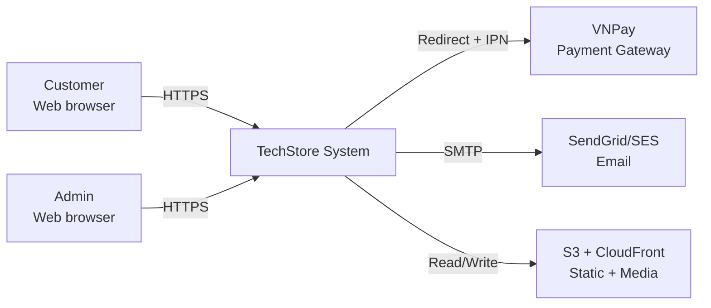
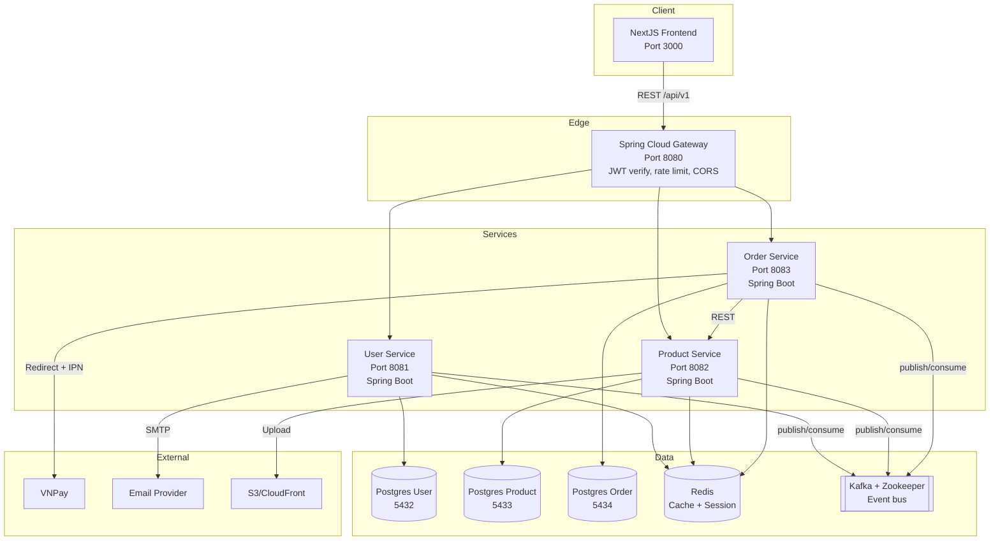

# Architecture Overview (HLD)

## Tóm tắt
Kiến trúc microservices với 3 backend services (User, Product, Order), 1 frontend NextJS, API Gateway, Kafka event bus, Redis cache. Communication: REST (sync) + Kafka (async). DB per service (PostgreSQL).

## Context Links
- Tech stack: [01-tech-stack.md](./01-tech-stack.md)
- Sequence diagrams: [02-sequence-diagrams.md](./02-sequence-diagrams.md)
- Class diagrams: [03-class-diagrams.md](./03-class-diagrams.md)
- Services: [services/user-service.md](./services/user-service.md), [services/product-service.md](./services/product-service.md), [services/order-service.md](./services/order-service.md)
- Frontend: [frontend.md](./frontend.md)

## Context Diagram (C4 L1)



## Container Diagram (C4 L2)



## Service Boundaries

| Service | Owns | Không owns |
|---|---|---|
| User | user, address, refresh_token, role | product, order |
| Product | product, category, stock, review | user, order |
| Order | cart, order, order_item, payment, order_state_log | product (chỉ snapshot), user (chỉ userId ref) |

**Rule cứng**: Service không được query DB của service khác. Lấy data qua REST API hoặc consume event.

## Integration Patterns

### Synchronous (REST)
Dùng khi:
- FE cần data real-time (GET product, GET order)
- Order service cần validate product tồn tại + giá + stock lúc checkout
- Admin cần query cross-service cho dashboard

Format:
- JSON
- Versioned `/api/v1/`
- Pagination: `?page=0&size=20&sort=field,asc|desc`
- Error: `{ code, message, details? }`
- Auth: `Authorization: Bearer <JWT>`
- Gateway inject: `X-User-Id`, `X-User-Role` headers

### Asynchronous (Kafka)
Dùng khi:
- Event notification cross-service không cần realtime response (VD: OrderPlaced → reserve stock)
- Fan-out events (1 event, N consumer)
- Decouple service availability

Envelope chuẩn:
```json
{
  "eventId": "uuid",
  "eventType": "OrderPlaced",
  "version": "1.0",
  "occurredAt": "2026-04-21T10:30:00Z",
  "producer": "order-service",
  "data": { ... }
}
```

Topic naming: `{service}.{entity}.{action}` — VD `order.order.placed`, `product.stock.reserved`.

Partitioning: key = aggregate root ID (orderId / productId / userId) → đảm bảo order events cho cùng aggregate vào cùng partition.

Retry: consumer retry 3 lần với backoff, thất bại → Dead Letter Queue (DLQ) topic `{original}.dlq`.

## Cross-cutting concerns

### Authentication
- Gateway verify JWT ở edge. Downstream services trust header `X-User-Id`, `X-User-Role`.
- Services không tự verify JWT (trust gateway).
- Inter-service call (server-to-server): dùng service account JWT với role=SYSTEM.

### Authorization
- Gateway filter routes theo role: `/api/v1/admin/**` yêu cầu role ADMIN.
- Service-level: `@PreAuthorize` cho fine-grained (VD: user chỉ xem order của mình).

### Caching
- Redis: shared cache, namespace per service (`user:`, `product:`, `order:`).
- Pattern: cache-aside (read: check cache → miss → DB → set cache). TTL 5-60 phút tuỳ data.
- Invalidation: publish cache invalidation event trên Kafka (hoặc TTL nếu stale OK).

### Observability
- Logs: structured JSON, ship stdout → Fluent Bit → Loki (hoặc CloudWatch).
- Metrics: Micrometer → Prometheus → Grafana.
- Tracing: OpenTelemetry → Jaeger. `traceId` propagate qua header `traceparent`.
- Health check: `/actuator/health` per service, gateway aggregate `/health`.

### Resilience
- Resilience4j: Circuit Breaker + Retry + Timeout cho inter-service calls.
- Timeout defaults: connect 3s, read 10s.
- Circuit breaker: 50% fail trong 10 requests → open 30s.

### Rate Limiting
- Gateway: Redis-backed, per-IP cho public endpoints (login: 10/min, register: 3/min).
- Per-user cho authenticated endpoints (generic: 100/min).

## Data Flow Examples

### Customer checkout (high-level)
1. FE → Gateway → Order Service `POST /checkout`
2. Order Service → Product Service `POST /products/validate` (batch)
3. Order Service → DB: create order PENDING
4. Order Service → Kafka: `OrderPlaced`
5. Product Service consume → reserve stock → publish `StockReserved`
6. Order Service (async): FE redirect VNPay nếu VNPay
7. VNPay callback → Order Service IPN endpoint → update PAID → publish `OrderPaid`
8. Product Service consume `OrderPaid` → commit stock

### Admin update product stock
1. Admin FE → Gateway (role ADMIN) → Product Service `PATCH /admin/products/{id}/stock`
2. Product Service: update DB, log to `stock_log`
3. Product Service → Kafka: `ProductUpdated`
4. (Cache invalidation: consumers invalidate `product:{id}` Redis key)

## Deployment

### Dev (Docker Compose)
- Single `docker-compose.yml`
- Services expose ports localhost
- Hot reload: Spring DevTools (BE), NextJS fast refresh (FE)

### Prod (Kubernetes)
- Namespace: `techstore-prod`
- Each service: Deployment (2-3 replicas) + Service (ClusterIP) + HPA (CPU 70%)
- Gateway: Ingress (nginx) + LoadBalancer
- Postgres: StatefulSet with PVC (dev); managed RDS (prod recommended)
- Kafka: Strimzi operator (dev); managed MSK/Confluent (prod)
- Secrets: Kubernetes Secrets (dev); Vault/AWS Secrets Manager (prod)
- TLS: cert-manager + Let's Encrypt

## Non-functional Requirements

| NFR | Target |
|---|---|
| Availability | 99.5% (4.38h downtime/year) |
| API latency p95 | <= 500ms (most endpoints), <= 2s (search) |
| Throughput | 1000 req/s at peak |
| Scalability | Horizontal: stateless services, scale pod 2x-10x |
| Data durability | Postgres WAL backup daily + PITR |
| Disaster recovery | RTO 4h, RPO 15 phút |
| Security | OWASP Top 10, quarterly pentest (phase 2) |
