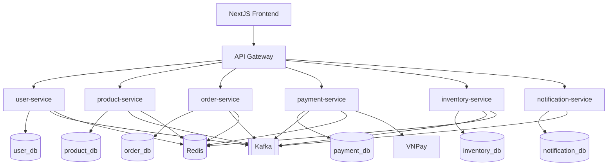

# Architecture Overview (v2)

## Tóm tắt
Hệ thống dùng kiến trúc microservices: 1 FE, 1 API Gateway, 6 backend services (user, product, order, payment, inventory, notification). Mô hình giao tiếp kết hợp REST sync + event async.

## Context Links
- Tech stack: [01-tech-stack.md](./01-tech-stack.md)
- Sequence: [02-sequence-diagrams.md](./02-sequence-diagrams.md)
- Class diagrams: [03-class-diagrams.md](./03-class-diagrams.md)
- Services: [services/](./services/)

## Container Diagram

## Service Boundaries
| Service | Owns | Không owns |
|---|---|---|
| user-service | auth, profile, address | order, payment, inventory |
| product-service | catalog, category, review | reserve/commit/release stock |
| order-service | cart, order lifecycle | payment callback logic, stock mutation |
| payment-service | payment transaction, VNPay callback | order state machine |
| inventory-service | available/reserved stock ledger | product metadata, payment |
| notification-service | template, delivery log, retry | business state |
| api-gateway | edge auth/routing/rate-limit | domain business logic |

## Integration Pattern
### Sync REST
- FE -> Gateway -> service APIs.
- order-service gọi product-service/user-service cho validation/query cần realtime.

### Async Events
- order-service phát OrderPlaced/StateChanged.
- payment-service phát PaymentSucceeded/Failed.
- inventory-service phát StockReserved/Committed/Released.
- notification-service consume event để gửi email.

## Cross-cutting
- JWT verify tại Gateway cho protected routes.
- Rate limit tại Gateway cho login/register/payment callback endpoints.
- Trace headers truyền xuyên suốt qua services.
- Mọi state transition quan trọng cần audit log + event.

## Deployment Notes
- Local: docker-compose (7 container chính).
- Prod: Kubernetes, scale độc lập theo service.
- Recommendation: tách DB per service theo đúng ownership.
