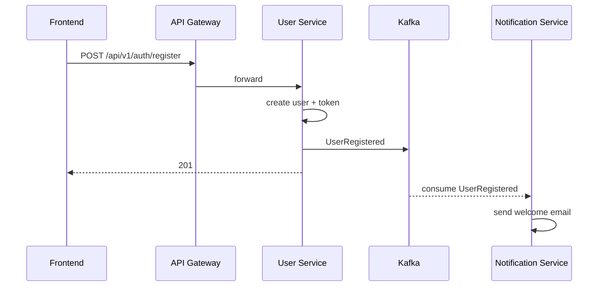
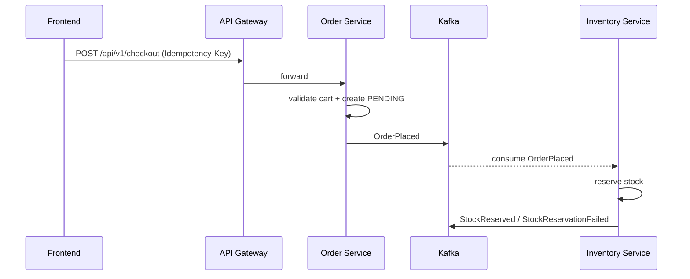
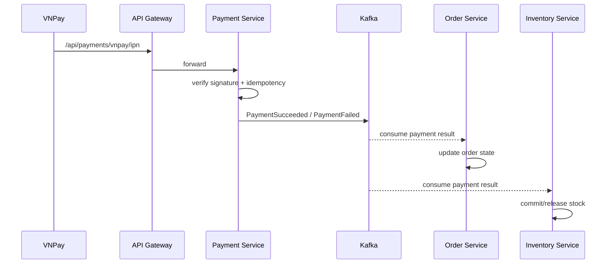
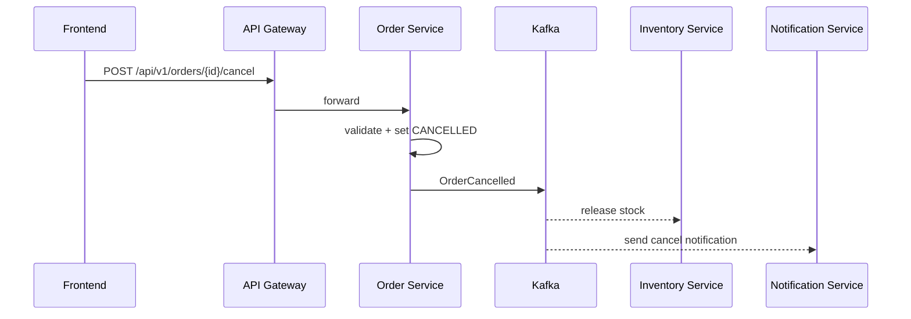
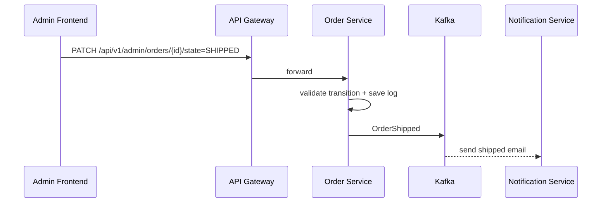

# Sequence Diagrams (v2)

## Tóm tắt
Các luồng chính đã được cập nhật theo kiến trúc tách payment/inventory/notification.

## Context Links
- Overview: [00-overview.md](./00-overview.md)
- Service docs: [services/](./services/)

## 1) Register + Welcome Email

## 2) Checkout Create Order + Reserve Stock

## 3) VNPay Callback Processing

## 4) Customer Cancel Order

## 5) Admin Ship Order

