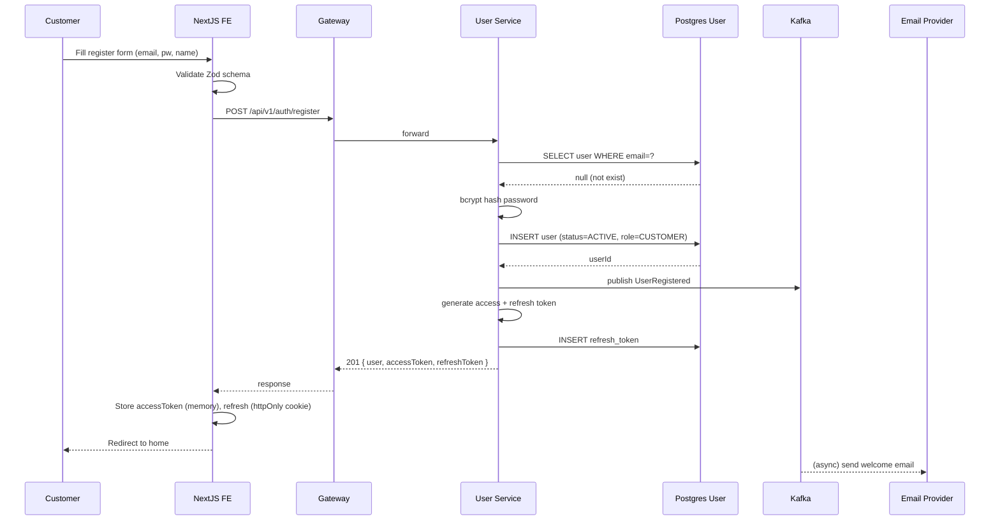
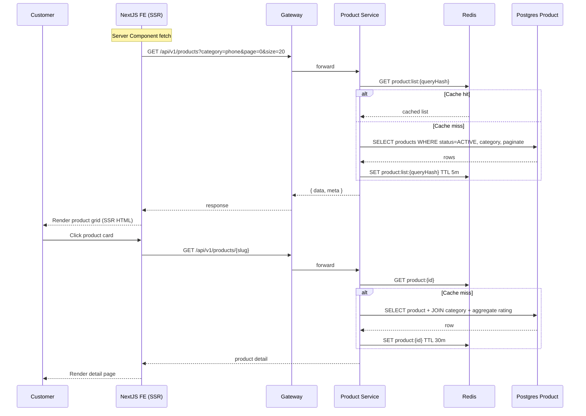
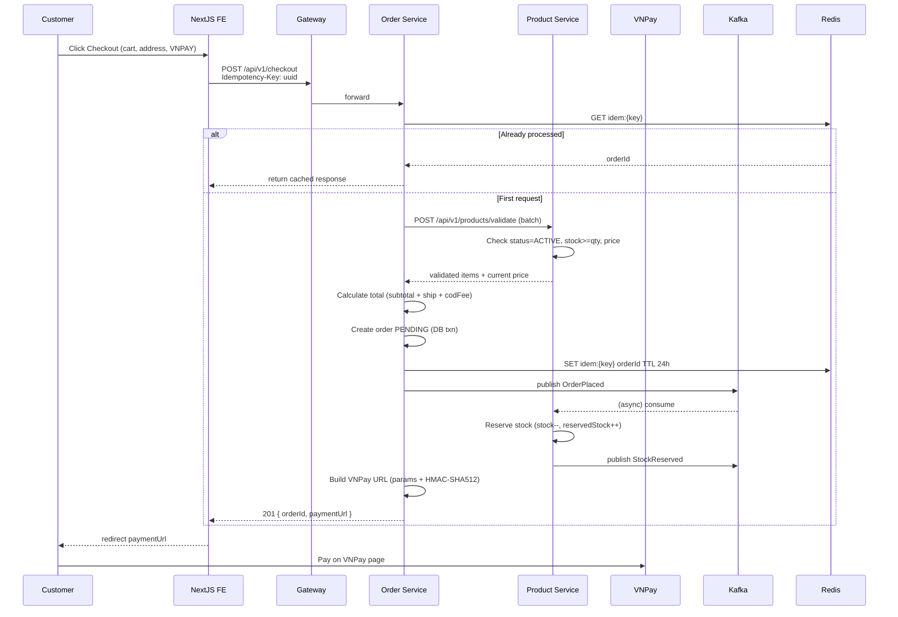
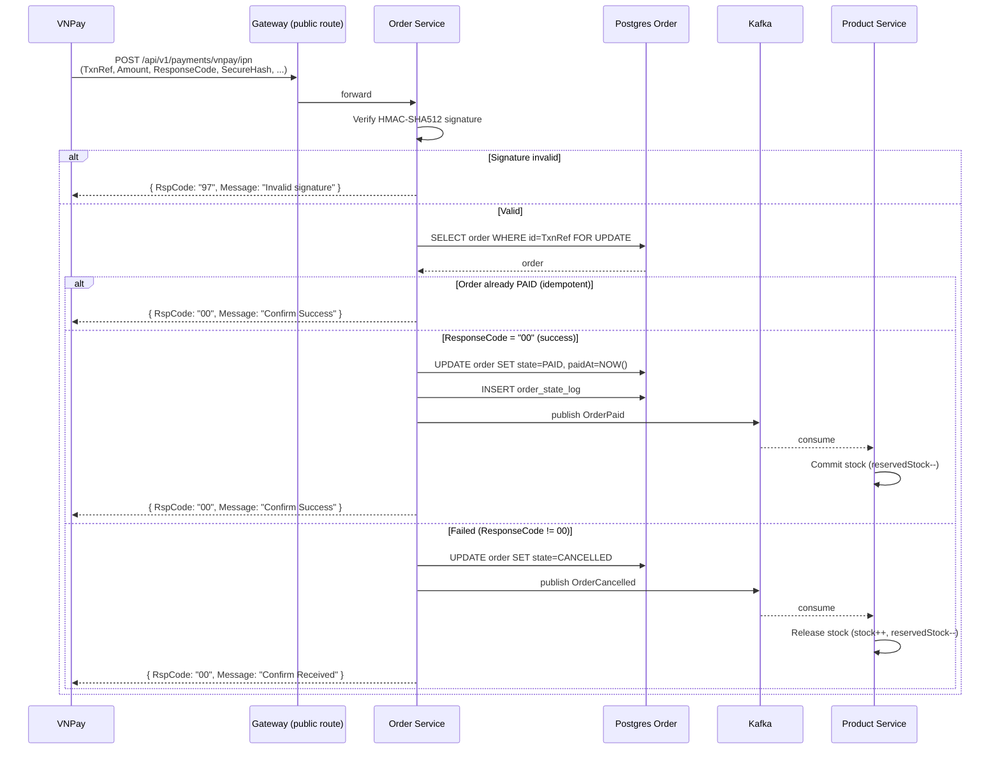
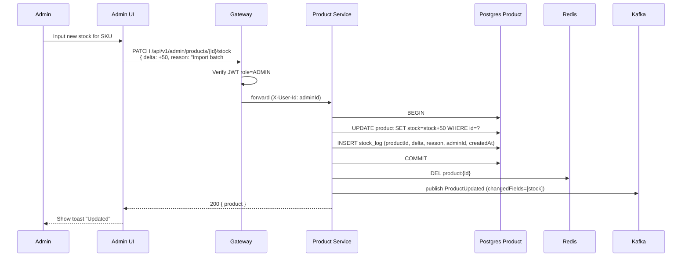
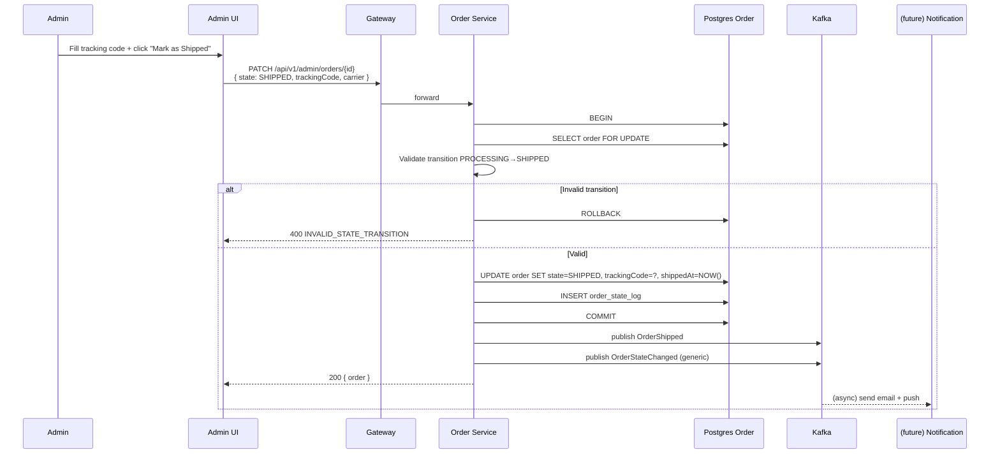

# Sequence Diagrams (LLD)

## Tóm tắt
Sequence diagrams cho 7 critical flows: Register, Login, Browse Product, Checkout (VNPay), Payment Callback, Admin Update Stock, Order State Sync. AI đọc trước khi implement mỗi flow.

## Context Links
- Overview: [00-overview.md](./00-overview.md)
- Class diagrams: [03-class-diagrams.md](./03-class-diagrams.md)
- Services: [services/](./services/)

---

## 1. Register (UC-AUTH)



---

## 2. Login (UC-AUTH)

```mermaid
sequenceDiagram
    participant C as Customer
    participant FE as NextJS FE
    participant GW as Gateway
    participant US as User Service
    participant DB as Postgres User
    participant R as Redis

    C->>FE: Fill login form (email, pw)
    FE->>GW: POST /api/v1/auth/login
    GW->>R: INCR rate:login:{ip}, check <= 10/min
    R-->>GW: ok
    GW->>US: forward
    US->>R: GET login-fail:{email}
    R-->>US: count (< 5 OK)
    US->>DB: SELECT user WHERE email=?
    DB-->>US: user or null
    alt User not found or password mismatch
        US->>R: INCR login-fail:{email} TTL 15m
        US-->>GW: 401 INVALID_CREDENTIALS
        GW-->>FE: error
    else Status = BLOCKED
        US-->>GW: 403 USER_BLOCKED
    else Success
        US->>R: DEL login-fail:{email}
        US->>US: generate access + refresh
        US->>DB: INSERT refresh_token
        US-->>GW: 200 { user, tokens }
        GW-->>FE: response
        FE->>FE: Store tokens
    end
```



---

## 3. Browse Product & Detail (UC-PRODUCT-BROWSE)



---

## 4. Checkout + VNPay (UC-CHECKOUT-PAYMENT)



---

## 5. VNPay IPN Callback (UC-CHECKOUT-PAYMENT)



---

## 6. Admin Update Stock (UC-ADMIN-PRODUCT)



---

## 7. Order State Sync — Admin Ship Order (UC-ADMIN-ORDER)



---

## Common patterns

### Pattern: Optimistic lock cho state transition
```
SELECT ... FOR UPDATE  (pessimistic)
OR
UPDATE ... WHERE state=<expected_from> (optimistic, check rows affected)
```
MVP dùng pessimistic (`FOR UPDATE`) cho order state — đơn giản, đúng.

### Pattern: Idempotent consumer
Mỗi consumer lưu `eventId` đã xử lý vào Redis key `consumed:{service}:{eventId}` TTL 7d.
Khi nhận event: check key tồn tại → skip. Xử lý xong → SET key.

### Pattern: Saga compensation
VNPay fail → không có compensation (order CANCELLED + stock release).
Stock reserve fail → Order service nhận `StockReservationFailed` → auto cancel order PENDING → refund nếu đã PAID (rare case).
