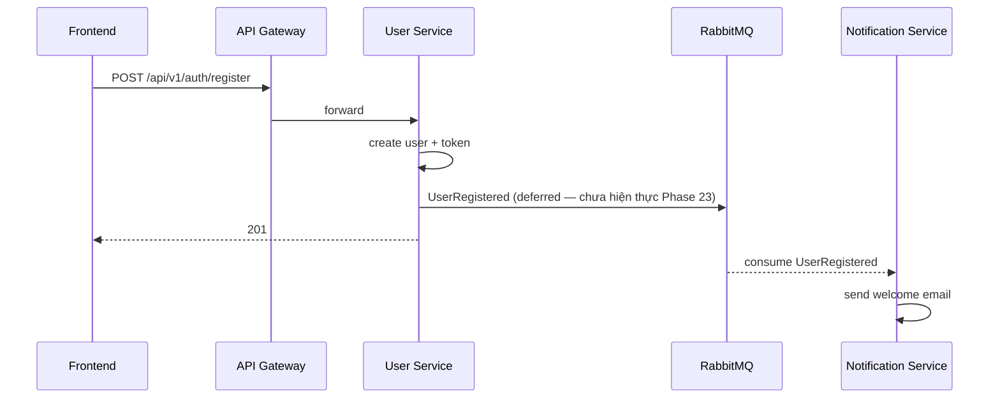
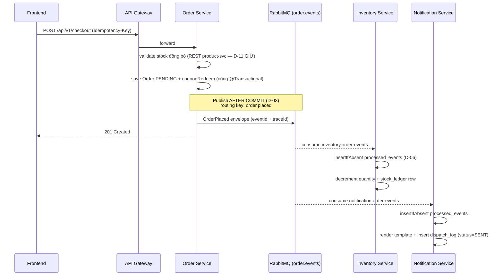
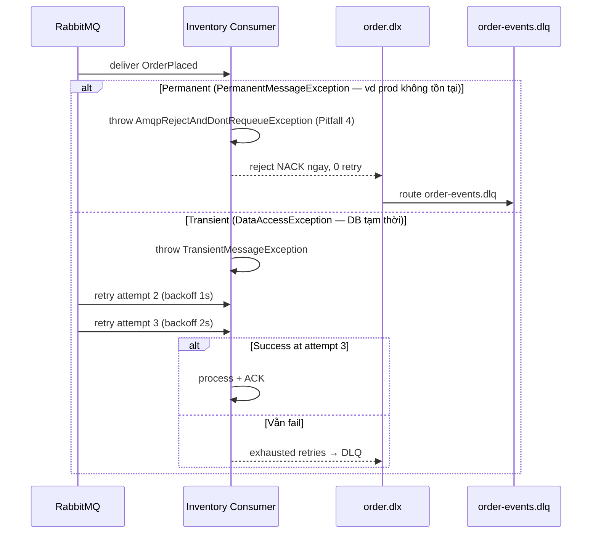
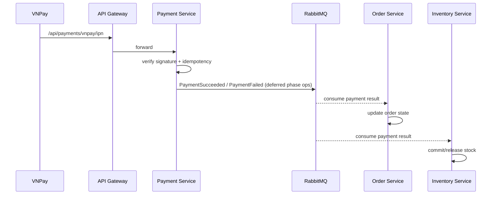
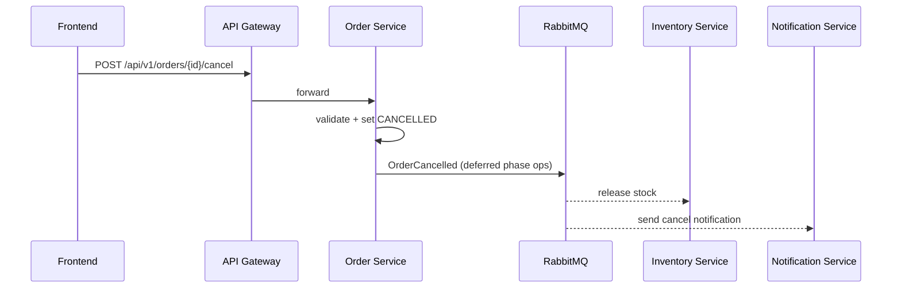
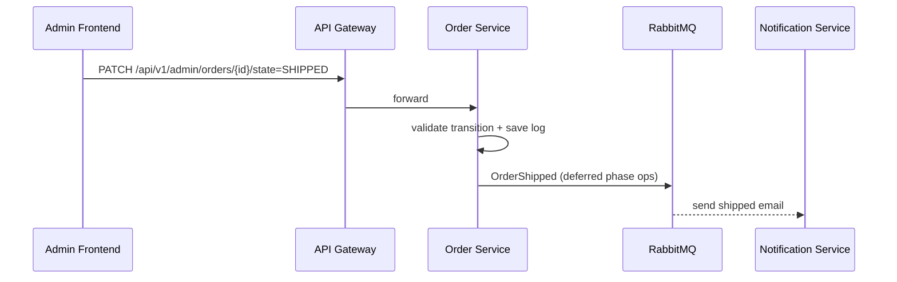

# Sequence Diagrams (v2)

## Tóm tắt
Các luồng chính đã được cập nhật theo kiến trúc tách payment/inventory/notification.

> **Phase 23 update (2026-05-20)** — Broker async chuyển từ Kafka sang **RabbitMQ** (đề chủ đề 4
> microservice scope, RabbitMQ có sẵn DLX + Management UI cho demo). Topology mới:
> `order.events` (topic exchange) → routing key `order.placed` → queue `inventory.order-events`
> + `notification.order-events` (binding `order.#`); DLX `order.dlx` + DLQ `order-events.dlq`.
> Xem appendix cuối file + `.planning/phases/23-message-queue-rabbitmq/23-CONTEXT.md`.

## Context Links
- Overview: [00-overview.md](./00-overview.md)
- Service docs: [services/](./services/)

## 1) Register + Welcome Email

```mermaid
sequenceDiagram
    participant FE as Frontend
    participant GW as API Gateway
    participant US as User Service
    participant MQ as RabbitMQ
    participant N as Notification Service

    FE->>GW: POST /api/v1/auth/register
    GW->>US: forward
    US->>US: create user + token
    US->>MQ: UserRegistered (deferred — chưa hiện thực Phase 23)
    US-->>FE: 201
    MQ-->>N: consume UserRegistered
    N->>N: send welcome email
```

> Note: UserRegistered event chưa hiện thực ở Phase 23 (scope: chỉ OrderPlaced). Welcome email
> defer phase ops.

## 2) Checkout Create Order + Trừ Kho (RabbitMQ — Phase 23)

```mermaid
sequenceDiagram
    participant FE as Frontend
    participant GW as API Gateway
    participant OS as Order Service
    participant MQ as RabbitMQ (order.events)
    participant INV as Inventory Service
    participant N as Notification Service

    FE->>GW: POST /api/v1/checkout (Idempotency-Key)
    GW->>OS: forward
    OS->>OS: validate stock đồng bộ (REST product-svc — D-11 GIỮ)
    OS->>OS: save Order PENDING + couponRedeem (cùng @Transactional)
    Note over OS,MQ: Publish AFTER COMMIT (D-03)<br/>routing key: order.placed
    OS->>MQ: OrderPlaced envelope (eventId + traceId)
    OS-->>FE: 201 Created
    MQ-->>INV: consume inventory.order-events
    INV->>INV: insertIfAbsent processed_events (D-06)
    INV->>INV: decrement quantity + stock_ledger row
    MQ-->>N: consume notification.order-events
    N->>N: insertIfAbsent processed_events
    N->>N: render template + insert dispatch_log (status=SENT)
```

> Trace propagation: X-Trace-Id header set qua TraceIdMessagePostProcessor; consumer dùng
> TraceIdConsumerInterceptor.enter/exit bind MDC traceId trong lifetime listener.

### Error path: Permanent vs Transient (D-07/D-08)

```mermaid
sequenceDiagram
    participant MQ as RabbitMQ
    participant INV as Inventory Consumer
    participant DLX as order.dlx
    participant DLQ as order-events.dlq

    MQ->>INV: deliver OrderPlaced
    alt Permanent (PermanentMessageException — vd prod không tồn tại)
        INV->>INV: throw AmqpRejectAndDontRequeueException (Pitfall 4)
        INV-->>DLX: reject NACK ngay, 0 retry
        DLX->>DLQ: route order-events.dlq
    else Transient (DataAccessException — DB tạm thời)
        INV->>INV: throw TransientMessageException
        MQ->>INV: retry attempt 2 (backoff 1s)
        MQ->>INV: retry attempt 3 (backoff 2s)
        alt Success at attempt 3
            INV->>INV: process + ACK
        else Vẫn fail
            INV-->>DLX: exhausted retries → DLQ
        end
    end
```

## 3) VNPay Callback Processing

```mermaid
sequenceDiagram
    participant V as VNPay
    participant GW as API Gateway
    participant PAY as Payment Service
    participant MQ as RabbitMQ
    participant OS as Order Service
    participant INV as Inventory Service

    V->>GW: /api/payments/vnpay/ipn
    GW->>PAY: forward
    PAY->>PAY: verify signature + idempotency
    PAY->>MQ: PaymentSucceeded / PaymentFailed (deferred phase ops)
    MQ-->>OS: consume payment result
    OS->>OS: update order state
    MQ-->>INV: consume payment result
    INV->>INV: commit/release stock
```

> Note: PaymentSucceeded/Failed event chưa hiện thực Phase 23 (scope chỉ OrderPlaced).

## 4) Customer Cancel Order

```mermaid
sequenceDiagram
    participant FE as Frontend
    participant GW as API Gateway
    participant OS as Order Service
    participant MQ as RabbitMQ
    participant INV as Inventory Service
    participant N as Notification Service

    FE->>GW: POST /api/v1/orders/{id}/cancel
    GW->>OS: forward
    OS->>OS: validate + set CANCELLED
    OS->>MQ: OrderCancelled (deferred phase ops)
    MQ-->>INV: release stock
    MQ-->>N: send cancel notification
```

> Note: OrderCancelled event chưa hiện thực Phase 23.

## 5) Admin Ship Order

```mermaid
sequenceDiagram
    participant FE as Admin Frontend
    participant GW as API Gateway
    participant OS as Order Service
    participant MQ as RabbitMQ
    participant N as Notification Service

    FE->>GW: PATCH /api/v1/admin/orders/{id}/state=SHIPPED
    GW->>OS: forward
    OS->>OS: validate transition + save log
    OS->>MQ: OrderShipped (deferred phase ops)
    MQ-->>N: send shipped email
```

> Note: OrderShipped event chưa hiện thực Phase 23.

## Appendix A — RabbitMQ Topology (Phase 23)

Tham chiếu: `.planning/phases/23-message-queue-rabbitmq/23-CONTEXT.md`, decisions D-01..D-18.

| Resource | Type | Properties |
|----------|------|------------|
| `order.events` | TopicExchange | durable=true |
| `order.dlx` | DirectExchange (DLX) | durable=true |
| `order-events.dlq` | Queue | durable; bind `order.dlx` với routing key `order-events` |
| `inventory.order-events` | Queue | durable; bind `order.events` key `order.#`; x-dead-letter-exchange=`order.dlx` |
| `notification.order-events` | Queue | durable; bind `order.events` key `order.#`; x-dead-letter-exchange=`order.dlx` |

**Routing key publish**: `order.placed` (binding wildcard `order.#` cả 2 queue đều match).

**Retry policy (D-07)**: 3 attempts, exponential backoff 1s/2s/4s, max-interval 10s, multiplier 2.
Test profile override: 100ms initial-interval cho IT chạy gọn.

**Idempotency (D-06)**: Mỗi consumer schema có bảng `processed_events` (PK `event_id`); listener
`INSERT ... ON CONFLICT DO NOTHING` trong cùng @Transactional với business logic — duplicate
eventId → skip + ACK.

**Publisher confirms (D-04)**: RabbitTemplate.setMandatory(true) + spring.rabbitmq.publisher-confirm-type=correlated;
block tối đa 5s/event; nack/timeout → log `[MQ-PUB-NACK]` / `[MQ-PUB-TIMEOUT]` không rollback order
(D-05: order đã saved, nhất quán user-facing ưu tiên hơn).

**Trace propagation (D-16)**: header `X-Trace-Id` set bởi TraceIdMessagePostProcessor; consumer
bind MDC qua TraceIdConsumerInterceptor → grep log `traceId=<uuid>` qua 3 service trace 1 order.

**Smoke verify**: `bash scripts/verify-mq.sh` — curl Management UI HTTP API check exchanges/queues
sau `docker compose up`.

**Integration tests (Plan 23-06)**: 9 @Test methods qua 3 IT class với Testcontainers
`postgres:16-alpine` + `rabbitmq:3-management` (@ServiceConnection Spring Boot 3.1+).
