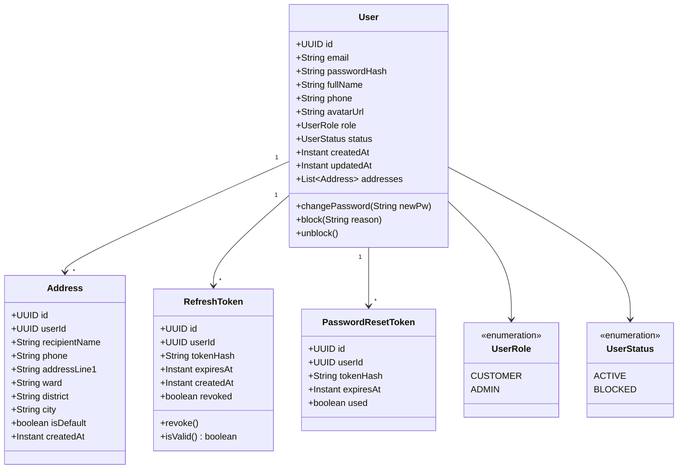
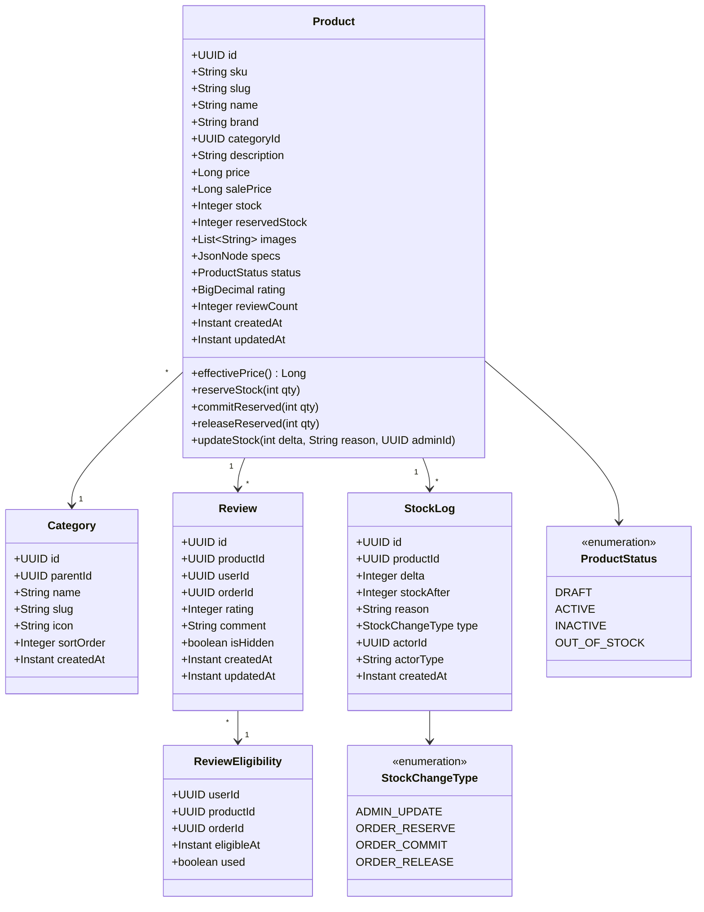
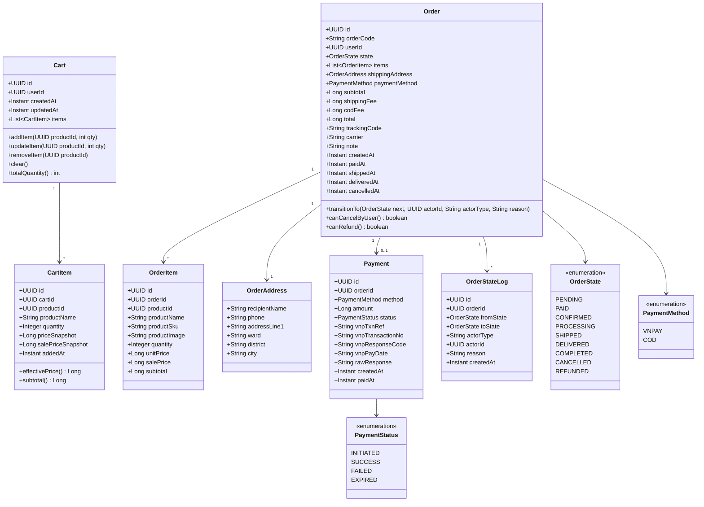

# Class Diagrams (LLD)

## Tóm tắt
Domain model class diagrams cho 3 services. Chỉ core entities (~30%) — details field phụ, enum values xem trong TS files. AI dùng để hiểu quan hệ entity trước khi code.

## Context Links
- Overview: [00-overview.md](./00-overview.md)
- Sequence diagrams: [02-sequence-diagrams.md](./02-sequence-diagrams.md)
- Services: [services/](./services/)

---

## User Service Domain

---

## Product Service Domain

---

## Order Service Domain

---

## Shared patterns

### ID strategy
- UUID v7 (time-ordered) cho tất cả entity — tránh hot partition khi insert nhiều.
- Order có thêm `orderCode` human-readable: `ORD-{YYYYMMDD}-{seq6}` (VD `ORD-20260421-000123`).

### Audit fields
Mọi entity có: `createdAt` (Instant), `updatedAt` (Instant). Auto-populate bằng JPA `@CreationTimestamp` / `@UpdateTimestamp`.

### Soft delete
- `Product`: không xóa, dùng `status=INACTIVE`.
- `User`: không xóa, dùng `status=BLOCKED`.
- `Order`: không xóa, dùng `state=CANCELLED`.
- `Review`: không xóa, dùng `isHidden=true`.

### Money type
- Dùng `Long` cho VND (integer, không có decimal).
- Không dùng `BigDecimal` (overkill cho VND).
- Rating: `BigDecimal(3,1)` — VD 4.3.

### JSON fields
- `Product.specs`: `JsonNode` (Jackson) mapped với JPA `@Type(JsonBinaryType.class)` (Hibernate Types lib).
- Query JSONB: Postgres `jsonb` operators `->>`, `@>`.

### Event payload vs Entity
- Event payload là DTO riêng (record), không serialize entity trực tiếp.
- Giữ ổn định schema event qua versioning (`version: "1.0"` trong envelope).
