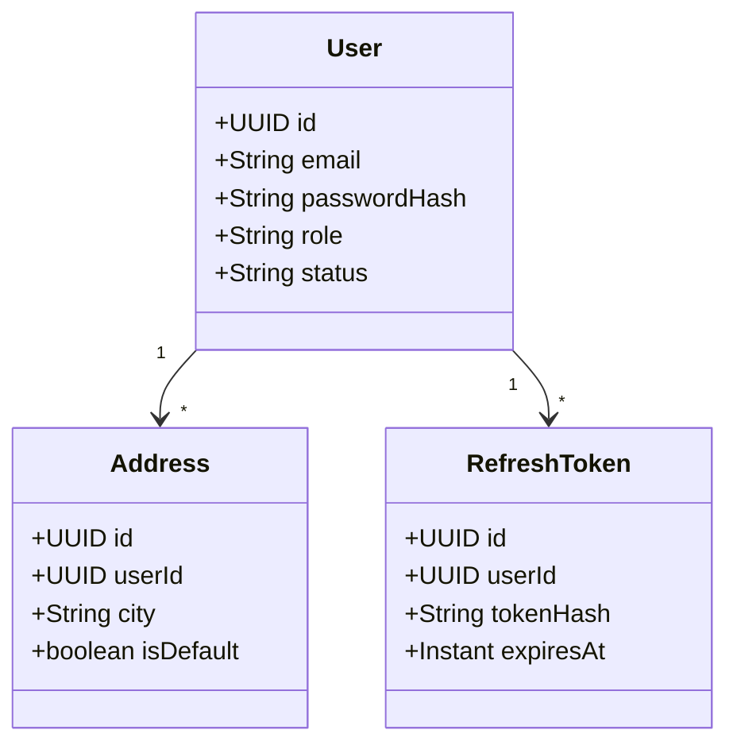
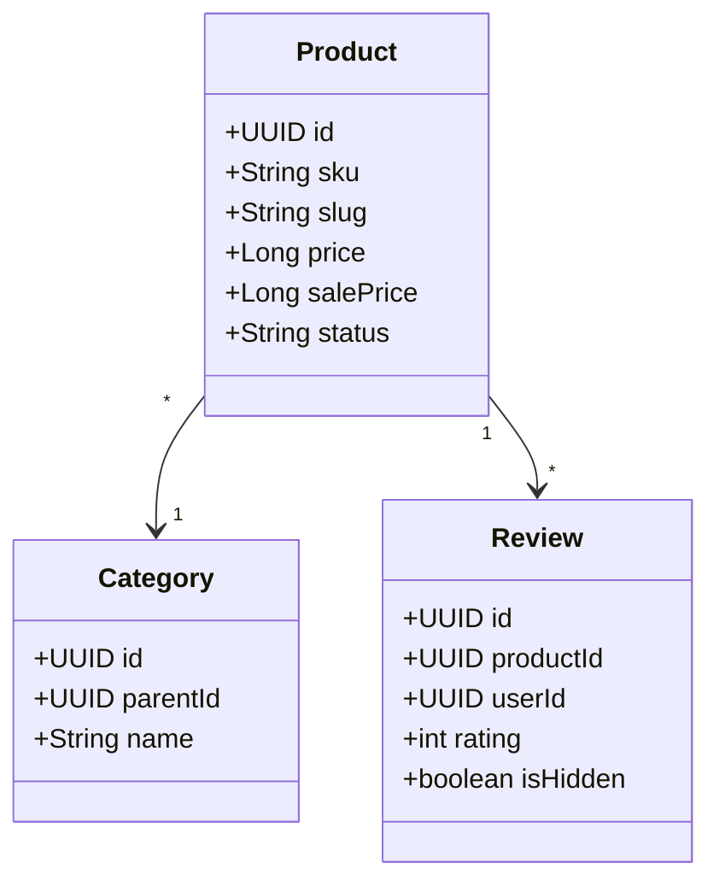
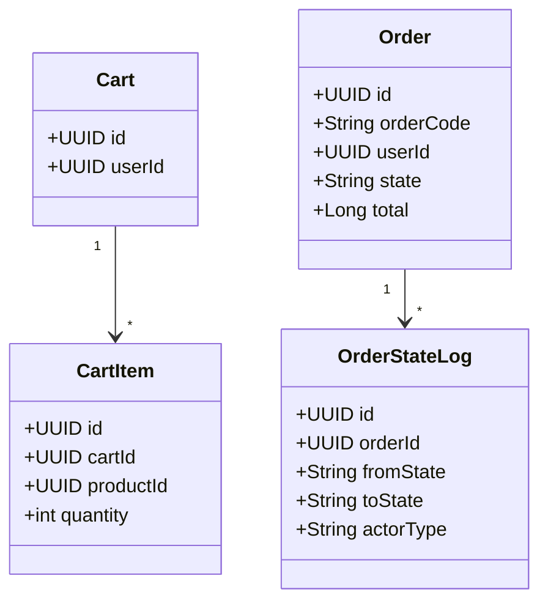
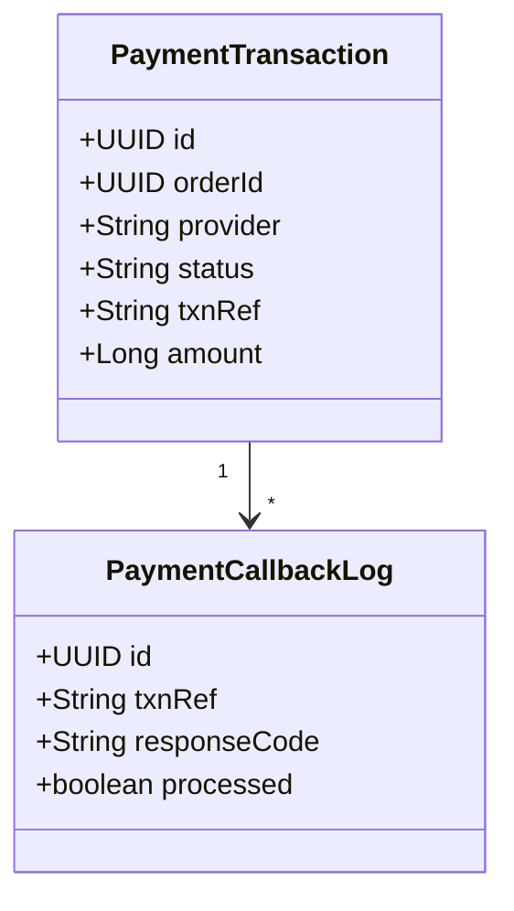
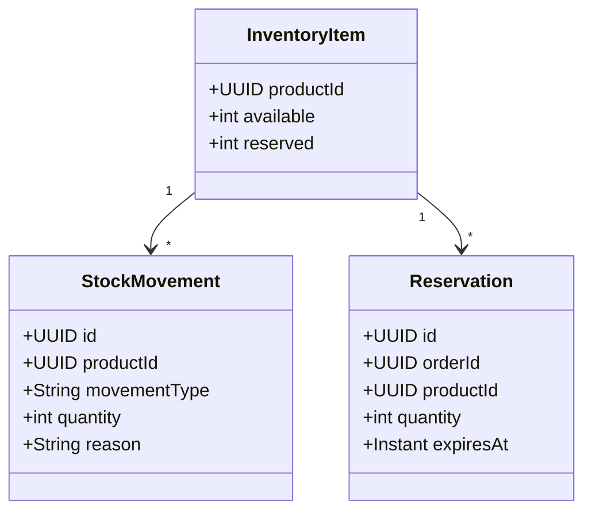
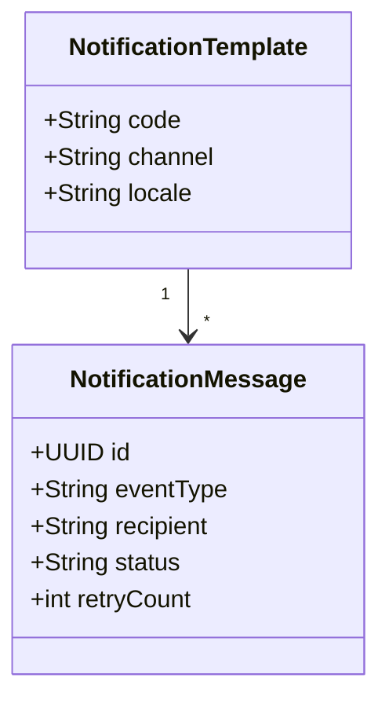

# Class Diagrams (v2)

## Tóm tắt
Domain model rút gọn theo 6 backend services. Dùng cho định hướng ownership và mapping entity khi implement.

## User Service

## Product Service

## Order Service

## Payment Service

## Inventory Service

## Notification Service

