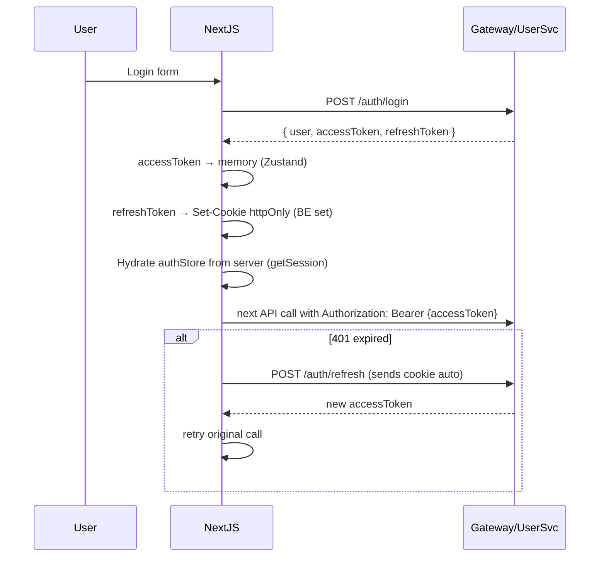

# Frontend Architecture (NextJS)

## Tóm tắt
NextJS 14 App Router với mix SSR (SEO critical: product list/detail, landing) + Client Components (interactive: cart, checkout, admin). Auth qua JWT lưu memory + refresh token httpOnly cookie. State: React Query (server state) + Zustand (UI state).

## Context Links
- Overview: [00-overview.md](./00-overview.md)
- Tech stack: [01-tech-stack.md](./01-tech-stack.md)

## Folder structure

```
splus-ecommerce-front/
├── app/
│   ├── layout.tsx                   # Root layout, Providers
│   ├── page.tsx                     # Homepage (SSR)
│   ├── (shop)/
│   │   ├── layout.tsx               # Shop layout (header, footer)
│   │   ├── category/[slug]/page.tsx # Category listing (SSG + revalidate)
│   │   ├── product/[slug]/page.tsx  # Product detail (SSG + revalidate)
│   │   ├── search/page.tsx          # Search results (SSR)
│   │   ├── cart/page.tsx            # Cart ("use client")
│   │   └── checkout/page.tsx        # Checkout ("use client")
│   ├── (auth)/
│   │   ├── login/page.tsx
│   │   ├── register/page.tsx
│   │   └── reset-password/page.tsx
│   ├── (account)/
│   │   ├── profile/page.tsx
│   │   ├── addresses/page.tsx
│   │   └── orders/
│   │       ├── page.tsx             # Order list
│   │       └── [id]/page.tsx        # Order detail
│   ├── (admin)/
│   │   ├── layout.tsx               # Admin layout (sidebar, role guard)
│   │   ├── admin/
│   │   │   ├── page.tsx             # Dashboard
│   │   │   ├── products/
│   │   │   │   ├── page.tsx         # Product list
│   │   │   │   ├── new/page.tsx
│   │   │   │   └── [id]/page.tsx    # Edit
│   │   │   ├── orders/
│   │   │   │   ├── page.tsx
│   │   │   │   └── [id]/page.tsx
│   │   │   └── users/page.tsx
│   └── api/                         # NextJS API routes (optional — proxy/webhook)
│       └── vnpay-return/route.ts    # Browser return from VNPay → redirect /orders/{id}
├── components/
│   ├── ui/                          # shadcn components (Button, Input, Dialog, ...)
│   ├── product/
│   │   ├── ProductCard.tsx
│   │   ├── ProductGrid.tsx
│   │   ├── ProductGallery.tsx
│   │   ├── ProductFilter.tsx
│   │   └── ReviewList.tsx
│   ├── cart/
│   │   ├── CartDrawer.tsx
│   │   ├── CartItem.tsx
│   │   └── CartSummary.tsx
│   ├── checkout/
│   │   ├── AddressForm.tsx
│   │   ├── PaymentSelector.tsx
│   │   └── OrderSummary.tsx
│   ├── order/
│   │   ├── OrderTimeline.tsx
│   │   └── OrderStatusBadge.tsx
│   ├── layout/
│   │   ├── Header.tsx
│   │   ├── Footer.tsx
│   │   └── SearchBar.tsx
│   └── auth/
│       └── LoginForm.tsx
├── lib/
│   ├── api/                         # API client functions
│   │   ├── client.ts                # Fetch wrapper (auth, error, retry)
│   │   ├── auth.api.ts
│   │   ├── product.api.ts
│   │   ├── cart.api.ts
│   │   ├── order.api.ts
│   │   └── admin.api.ts
│   ├── auth/
│   │   ├── session.ts               # Get session server-side (cookies)
│   │   └── client.ts                # Client-side auth helpers
│   ├── validations/                 # Zod schemas (share with form)
│   │   ├── auth.schema.ts
│   │   ├── checkout.schema.ts
│   │   └── product.schema.ts
│   ├── utils/
│   │   ├── format.ts                # formatCurrency, formatDate
│   │   └── cn.ts                    # className helper (shadcn)
│   └── constants.ts
├── stores/
│   ├── cart.store.ts                # Zustand guest cart (localStorage persist)
│   ├── ui.store.ts                  # Drawer, modal state
│   └── auth.store.ts                # Current user state (hydrate from cookie)
├── hooks/
│   ├── useAuth.ts
│   ├── useCart.ts
│   ├── useProducts.ts               # React Query wrapper
│   └── useOrders.ts
├── middleware.ts                    # Auth check for /admin, /account routes
├── types/
│   ├── api.ts                       # Response types (match BE contracts)
│   └── domain.ts                    # Domain types (Product, Order, ...)
├── public/
├── next.config.js
├── tailwind.config.ts
└── tsconfig.json
```

## Routing strategy

### Public routes (không auth)
- `/` — homepage
- `/category/[slug]` — category listing
- `/product/[slug]` — product detail
- `/search` — search results
- `/login`, `/register`, `/reset-password`

### Authenticated routes (require JWT)
- `/account/*` — profile, addresses, orders
- `/checkout` — checkout flow
- `/cart` — cart (có thể xem guest nhưng checkout phải login)

### Admin routes (require role=ADMIN)
- `/admin/*`

### Middleware check
```typescript
// middleware.ts
export function middleware(request: NextRequest) {
  const session = getSessionFromCookie(request);

  if (request.nextUrl.pathname.startsWith('/admin')) {
    if (!session || session.role !== 'ADMIN') {
      return NextResponse.redirect(new URL('/login', request.url));
    }
  }

  if (request.nextUrl.pathname.startsWith('/account')) {
    if (!session) {
      return NextResponse.redirect(new URL('/login', request.url));
    }
  }
}
```

## Rendering strategy

| Page | Mode | Rationale |
|---|---|---|
| Homepage | SSG + revalidate 5 min | SEO + cache |
| Category listing | SSG + revalidate 1 min | SEO, ít đổi |
| Product detail | SSG + revalidate 30s | SEO critical |
| Search | SSR | Query dynamic |
| Cart | CSR | Interactive, guest vs auth |
| Checkout | CSR | Form + payment redirect |
| Profile | CSR | Private data |
| Orders | CSR | Private data |
| Admin | CSR | Private, interactive |

## Data fetching

### Server Components
```tsx
// app/(shop)/product/[slug]/page.tsx
export async function generateMetadata({ params }) {
  const product = await productApi.getBySlug(params.slug);
  return { title: product.name, description: product.description };
}

export default async function ProductDetailPage({ params }) {
  const product = await productApi.getBySlug(params.slug);
  return <ProductDetail product={product} />;
}
```

### Client Components (React Query)
```tsx
"use client";
export default function CartPage() {
  const { data: cart } = useQuery({
    queryKey: ['cart'],
    queryFn: () => cartApi.get(),
  });
  return <Cart data={cart} />;
}
```

## Auth flow (client)



## API client pattern

```typescript
// lib/api/client.ts
export async function apiCall<T>(path: string, options?: RequestInit): Promise<T> {
  const token = useAuthStore.getState().accessToken;
  const res = await fetch(`${API_BASE}${path}`, {
    ...options,
    headers: {
      'Content-Type': 'application/json',
      ...(token && { Authorization: `Bearer ${token}` }),
      ...options?.headers,
    },
  });
  if (res.status === 401 && !path.includes('/auth/')) {
    // Try refresh once
    await refreshToken();
    return apiCall(path, options);
  }
  if (!res.ok) {
    const error = await res.json();
    throw new ApiError(error.code, error.message, res.status);
  }
  return res.json();
}
```

## State management

| Scope | Tool | Ví dụ |
|---|---|---|
| Server state (remote) | React Query | products, cart, orders |
| UI state (ephemeral) | Zustand | drawer open, toast, selected tab |
| Auth state | Zustand + hydrate from cookie | currentUser, tokens |
| Form state | React Hook Form | login form, checkout form |
| Guest cart | Zustand + persist middleware | items trong localStorage |

## Performance

### Images
- `next/image` với remotePatterns cho CloudFront domain.
- Placeholder blur cho product cards.
- Lazy load below fold.

### Code split
- Route-based (automatic với App Router).
- Dynamic import cho heavy: ProductGallery (swiper), Admin charts (recharts).

### Caching
- HTTP: `Cache-Control: public, max-age=300` cho static assets.
- Data: React Query staleTime 1-5 phút per query type.
- Next revalidate: 30s-5min tuỳ page.

## SEO

- `generateMetadata` cho product, category, landing pages.
- Dynamic OG image (backlog phase 2).
- Sitemap: `app/sitemap.ts` list products + categories.
- Robots: `app/robots.ts` allow all except `/admin`, `/account`, `/checkout`.
- JSON-LD schema (Product, BreadcrumbList) trong product page.

## Error handling

- Error Boundary: `error.tsx` per route group.
- 404: `not-found.tsx`.
- Global error: `global-error.tsx`.
- Toast: `sonner` library cho feedback.

## Testing

- **Unit**: Jest + RTL cho components, hooks.
- **E2E**: Playwright cho critical flows (register, login, add-to-cart, checkout).
- **Visual regression**: Playwright screenshots (phase 2).

## Accessibility

- Semantic HTML (button, nav, main).
- ARIA labels cho icons-only buttons.
- Keyboard navigation: Tab order, Esc close modal.
- Color contrast: WCAG AA.
- shadcn components đã accessible-by-default.
