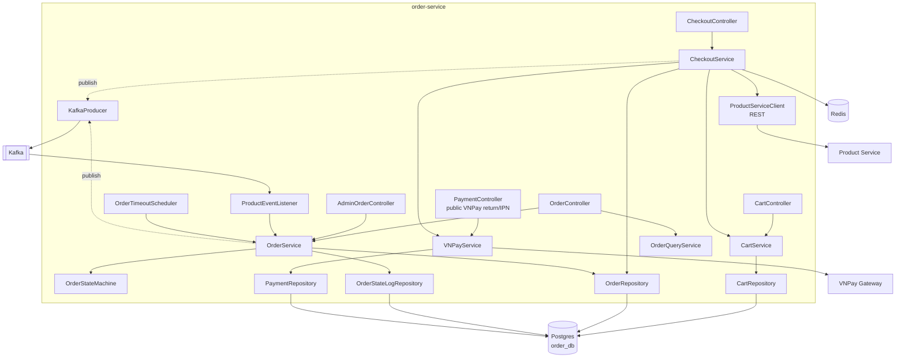
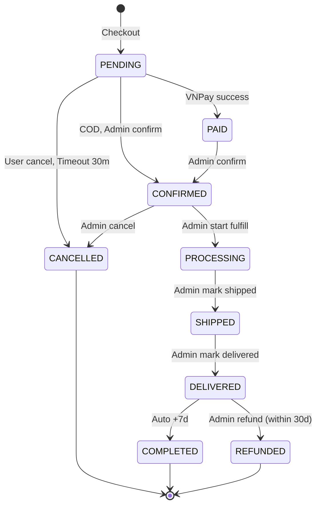

# Order Service (HLD + LLD)

## Tóm tắt
Order Service chạy port 8083, service phức tạp nhất: quản lý cart, checkout (với saga pattern), payment (VNPay + COD), order lifecycle (9 states). Publish events lifecycle, consume `StockReserved/Failed` để finalize checkout. Tích hợp external VNPay.

## Context Links
- Strategy: [../../strategy/services/order-business.md](../../strategy/services/order-business.md)
- Class diagram: [../03-class-diagrams.md#order-service-domain](../03-class-diagrams.md#order-service-domain)
- BA: [../../ba/uc-cart.md](../../ba/uc-cart.md), [../../ba/uc-checkout-payment.md](../../ba/uc-checkout-payment.md), [../../ba/uc-order-tracking.md](../../ba/uc-order-tracking.md), [../../ba/uc-admin-order.md](../../ba/uc-admin-order.md)
- TS: [../../technical-spec/ts-checkout-payment.md](../../technical-spec/ts-checkout-payment.md)

## Component Diagram



## Responsibilities

### Customer
| Responsibility | Endpoint |
|---|---|
| Get my cart | GET `/api/v1/cart` |
| Add to cart | POST `/api/v1/cart/items` |
| Update cart item | PATCH `/api/v1/cart/items/{productId}` |
| Remove cart item | DELETE `/api/v1/cart/items/{productId}` |
| Clear cart | DELETE `/api/v1/cart` |
| Merge guest cart (on login) | POST `/api/v1/cart/merge` |
| Checkout | POST `/api/v1/checkout` |
| List my orders | GET `/api/v1/orders` |
| Get my order detail | GET `/api/v1/orders/{id}` |
| Cancel pending order | POST `/api/v1/orders/{id}/cancel` |

### Payment (public, VNPay integration)
| Responsibility | Endpoint |
|---|---|
| VNPay browser return | GET `/api/v1/payments/vnpay/return` |
| VNPay IPN (server-to-server) | GET `/api/v1/payments/vnpay/ipn` |

### Admin
| Responsibility | Endpoint |
|---|---|
| List orders | GET `/api/v1/admin/orders` |
| Get order detail | GET `/api/v1/admin/orders/{id}` |
| Confirm order (COD) | POST `/api/v1/admin/orders/{id}/confirm` |
| Transition state | PATCH `/api/v1/admin/orders/{id}/state` |
| Add tracking code | PATCH `/api/v1/admin/orders/{id}/tracking` |
| Refund order | POST `/api/v1/admin/orders/{id}/refund` |

## Database Schema

### Table `cart`
| Column | Type | Constraint |
|---|---|---|
| id | UUID | PK |
| user_id | UUID | UNIQUE, NOT NULL |
| created_at | TIMESTAMP | NOT NULL DEFAULT now() |
| updated_at | TIMESTAMP | NOT NULL DEFAULT now() |

### Table `cart_item`
| Column | Type | Constraint |
|---|---|---|
| id | UUID | PK |
| cart_id | UUID | FK → cart(id) |
| product_id | UUID | NOT NULL |
| product_name | VARCHAR(200) | |
| product_image | VARCHAR(500) | |
| quantity | INT | NOT NULL CHECK (quantity BETWEEN 1 AND 10) |
| price_snapshot | BIGINT | NOT NULL |
| sale_price_snapshot | BIGINT | |
| added_at | TIMESTAMP | NOT NULL |
| UNIQUE (cart_id, product_id) |

### Table `order`
| Column | Type | Constraint |
|---|---|---|
| id | UUID | PK |
| order_code | VARCHAR(30) | UNIQUE, NOT NULL |
| user_id | UUID | NOT NULL |
| state | VARCHAR(20) | NOT NULL DEFAULT 'PENDING' |
| payment_method | VARCHAR(20) | NOT NULL |
| subtotal | BIGINT | NOT NULL |
| shipping_fee | BIGINT | NOT NULL DEFAULT 0 |
| cod_fee | BIGINT | NOT NULL DEFAULT 0 |
| total | BIGINT | NOT NULL |
| recipient_name | VARCHAR(100) | NOT NULL |
| recipient_phone | VARCHAR(20) | NOT NULL |
| address_line1 | VARCHAR(255) | NOT NULL |
| ward | VARCHAR(100) | |
| district | VARCHAR(100) | NOT NULL |
| city | VARCHAR(100) | NOT NULL |
| note | TEXT | |
| tracking_code | VARCHAR(100) | |
| carrier | VARCHAR(50) | |
| created_at | TIMESTAMP | NOT NULL DEFAULT now() |
| paid_at | TIMESTAMP | |
| confirmed_at | TIMESTAMP | |
| shipped_at | TIMESTAMP | |
| delivered_at | TIMESTAMP | |
| cancelled_at | TIMESTAMP | |
| completed_at | TIMESTAMP | |

Indexes: `idx_order_user (user_id, created_at DESC)`, `idx_order_state (state)`, `idx_order_code (order_code)`.

### Table `order_item`
| Column | Type | Constraint |
|---|---|---|
| id | UUID | PK |
| order_id | UUID | FK → order(id) |
| product_id | UUID | NOT NULL |
| product_name | VARCHAR(200) | NOT NULL |
| product_sku | VARCHAR(50) | NOT NULL |
| product_image | VARCHAR(500) | |
| quantity | INT | NOT NULL |
| unit_price | BIGINT | NOT NULL |
| sale_price | BIGINT | |
| subtotal | BIGINT | NOT NULL |

### Table `order_state_log`
| Column | Type | Constraint |
|---|---|---|
| id | UUID | PK |
| order_id | UUID | FK → order(id) |
| from_state | VARCHAR(20) | |
| to_state | VARCHAR(20) | NOT NULL |
| actor_type | VARCHAR(20) | NOT NULL |
| actor_id | UUID | |
| reason | TEXT | |
| created_at | TIMESTAMP | NOT NULL DEFAULT now() |

### Table `payment`
| Column | Type | Constraint |
|---|---|---|
| id | UUID | PK |
| order_id | UUID | FK → order(id) |
| method | VARCHAR(20) | NOT NULL |
| amount | BIGINT | NOT NULL |
| status | VARCHAR(20) | NOT NULL |
| vnp_txn_ref | VARCHAR(50) | |
| vnp_transaction_no | VARCHAR(50) | |
| vnp_response_code | VARCHAR(10) | |
| vnp_pay_date | VARCHAR(20) | |
| raw_response | JSONB | |
| created_at | TIMESTAMP | NOT NULL |
| paid_at | TIMESTAMP | |

## State Machine



Implementation: `OrderStateMachine.transition(order, nextState, actor, reason)` — validate matrix, update + insert log trong 1 transaction, publish event.

## Events Publish
| Event | Topic | Note |
|---|---|---|
| OrderPlaced | `order.order.placed` | Khi checkout xong |
| OrderPaid | `order.order.paid` | VNPay IPN success |
| OrderConfirmed | `order.order.confirmed` | Admin confirm |
| OrderProcessing | `order.order.processing` | |
| OrderShipped | `order.order.shipped` | + trackingCode |
| OrderDelivered | `order.order.delivered` | Critical cho review eligibility |
| OrderCancelled | `order.order.cancelled` | + reason |
| OrderRefunded | `order.order.refunded` | |
| OrderStateChanged | `order.order.state_changed` | Generic, all transitions |

## Events Consume
| Event | Source | Handler |
|---|---|---|
| StockReserved | product | Log success (không action, order đã tạo PENDING) |
| StockReservationFailed | product | Auto cancel order PENDING, refund nếu đã PAID |

## External: VNPay

### Redirect URL build
```
POST /checkout → create order PENDING → build redirect URL:
https://sandbox.vnpayment.vn/paymentv2/vpcpay.html
  ?vnp_Version=2.1.0
  &vnp_Command=pay
  &vnp_TmnCode={env}
  &vnp_Amount={total × 100}
  &vnp_CurrCode=VND
  &vnp_TxnRef={orderId}
  &vnp_OrderInfo=Thanh+toan+don+hang+{orderCode}
  &vnp_ReturnUrl={BASE}/api/v1/payments/vnpay/return
  &vnp_IpAddr={clientIp}
  &vnp_CreateDate={yyyyMMddHHmmss}
  &vnp_ExpireDate={+15min}
  &vnp_Locale=vn
  &vnp_OrderType=other
  &vnp_SecureHash={HMAC-SHA512(sortedQuery, secret)}
```

### IPN handling
- Endpoint: `GET /api/v1/payments/vnpay/ipn` (GET theo spec VNPay)
- Verify signature → check order state → update PAID hoặc CANCELLED → reply JSON `{ "RspCode": "00", "Message": "Confirm Success" }`
- Idempotent: nếu order đã PAID → reply success không update lại
- Response codes VNPay:
  - `00`: Success
  - `01`: Signature invalid → reply `97`
  - `02`: Order not found → reply `01`

## Scheduled Jobs

| Job | Cron | Task |
|---|---|---|
| Order timeout cancel | `*/5 * * * *` (every 5 min) | Find orders PENDING > 30 min → CANCELLED |
| Auto complete delivered | `0 2 * * *` (daily 2am) | Find orders DELIVERED > 7 days → COMPLETED |
| Cart cleanup | `0 3 * * *` (daily 3am) | Delete carts inactive > 30d |

## Config excerpt
```yaml
server:
  port: 8083

spring:
  datasource:
    url: jdbc:postgresql://postgres-order:5432/order_db

vnpay:
  tmn-code: ${VNP_TMN_CODE}
  secret-key: ${VNP_SECRET_KEY}
  pay-url: https://sandbox.vnpayment.vn/paymentv2/vpcpay.html
  return-url: ${BASE_URL}/api/v1/payments/vnpay/return
  ipn-url: ${BASE_URL}/api/v1/payments/vnpay/ipn
  expire-minutes: 15

product-service:
  base-url: http://product-service:8082
  timeout: 10s
  retry-max: 3

order:
  timeout-minutes: 30
  auto-complete-days: 7
  cod-fee-threshold: 1000000
  cod-fee: 20000
  free-ship-threshold: 3000000
  ship-fee-hcm-hn: 30000
  ship-fee-other: 50000
```

## Scalability
- Stateless service → scale 3-8 pods
- DB: partition `order` by `created_at` yearly (phase 2 khi > 5M orders)
- Kafka consumer: increase partitions cho `order.*` topics khi > 100 orders/min

## Monitoring
- Metrics: checkout success rate, payment success rate, order timeout rate, state transition error rate
- Alert: payment success < 90% (VNPay issue?), timeout rate > 15% (UX issue?)

## SLO
- POST /checkout: p95 < 1s
- GET /orders/{id}: p95 < 200ms
- VNPay IPN: p95 < 500ms (critical — VNPay timeout)
