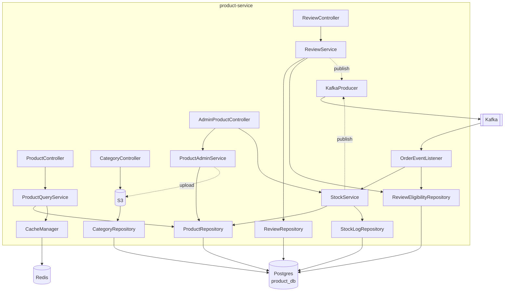

# Product Service (HLD + LLD)

## Tóm tắt
Product Service chạy port 8082, quản lý catalog (product, category), stock lifecycle, và review. DB riêng `product_db`. Publish events: `ProductCreated/Updated`, `StockReserved/Committed/Released`, `ReviewPosted`. Consume `OrderPlaced/Paid/Cancelled/Delivered`.

## Context Links
- Strategy: [../../strategy/services/product-business.md](../../strategy/services/product-business.md)
- Class diagram: [../03-class-diagrams.md#product-service-domain](../03-class-diagrams.md#product-service-domain)
- BA: [../../ba/uc-product-browse.md](../../ba/uc-product-browse.md), [../../ba/uc-product-review.md](../../ba/uc-product-review.md), [../../ba/uc-admin-product.md](../../ba/uc-admin-product.md)
- TS: [../../technical-spec/ts-product-browse.md](../../technical-spec/ts-product-browse.md)

## Component Diagram



## Responsibilities

### Public (customer-facing)
| Responsibility | Endpoint |
|---|---|
| List products | GET `/api/v1/products?category=&priceMin=&priceMax=&brand=&inStock=&sort=` |
| Get product detail | GET `/api/v1/products/{slug}` |
| Search products | GET `/api/v1/products/search?q=` |
| List categories | GET `/api/v1/categories` |
| Get category tree | GET `/api/v1/categories/tree` |
| Get product reviews | GET `/api/v1/products/{id}/reviews` |
| Post review | POST `/api/v1/products/{id}/reviews` |
| Update my review | PATCH `/api/v1/reviews/{id}` |

### Internal (service-to-service)
| Responsibility | Endpoint |
|---|---|
| Validate products (checkout) | POST `/api/v1/internal/products/validate` |
| Get products by IDs | GET `/api/v1/internal/products?ids=1,2,3` |

### Admin
| Responsibility | Endpoint |
|---|---|
| Create product | POST `/api/v1/admin/products` |
| Update product | PATCH `/api/v1/admin/products/{id}` |
| Update stock | PATCH `/api/v1/admin/products/{id}/stock` |
| Change product status | PATCH `/api/v1/admin/products/{id}/status` |
| Upload product image | POST `/api/v1/admin/products/{id}/images` |
| Create/Update category | POST/PATCH `/api/v1/admin/categories` |
| Hide review | PATCH `/api/v1/admin/reviews/{id}/hide` |
| Stock log report | GET `/api/v1/admin/products/{id}/stock-log` |

## Database Schema

### Table `category`
| Column | Type | Constraint |
|---|---|---|
| id | UUID | PK |
| parent_id | UUID | FK → category(id) NULL |
| name | VARCHAR(100) | NOT NULL |
| slug | VARCHAR(100) | UNIQUE, NOT NULL |
| icon | VARCHAR(200) | |
| sort_order | INT | DEFAULT 0 |
| created_at | TIMESTAMP | NOT NULL DEFAULT now() |

### Table `product`
| Column | Type | Constraint |
|---|---|---|
| id | UUID | PK |
| sku | VARCHAR(50) | UNIQUE, NOT NULL |
| slug | VARCHAR(200) | UNIQUE, NOT NULL |
| name | VARCHAR(200) | NOT NULL |
| brand | VARCHAR(50) | NOT NULL |
| category_id | UUID | FK → category(id), NOT NULL |
| description | TEXT | |
| price | BIGINT | NOT NULL CHECK (price >= 0) |
| sale_price | BIGINT | CHECK (sale_price IS NULL OR sale_price < price) |
| stock | INT | NOT NULL DEFAULT 0 CHECK (stock >= 0) |
| reserved_stock | INT | NOT NULL DEFAULT 0 CHECK (reserved_stock >= 0) |
| images | TEXT[] | NOT NULL DEFAULT '{}' |
| specs | JSONB | NOT NULL DEFAULT '{}' |
| status | VARCHAR(20) | NOT NULL DEFAULT 'DRAFT' |
| rating | NUMERIC(3,1) | DEFAULT 0 |
| review_count | INT | DEFAULT 0 |
| created_at | TIMESTAMP | NOT NULL DEFAULT now() |
| updated_at | TIMESTAMP | NOT NULL DEFAULT now() |

Indexes:
- `idx_product_status (status)`
- `idx_product_category (category_id, status)`
- `idx_product_slug (slug)`
- `idx_product_search` — GIN `to_tsvector('simple', unaccent(name || ' ' || brand))`

### Table `review`
| Column | Type | Constraint |
|---|---|---|
| id | UUID | PK |
| product_id | UUID | FK → product(id), NOT NULL |
| user_id | UUID | NOT NULL |
| order_id | UUID | NOT NULL |
| rating | INT | NOT NULL CHECK (rating BETWEEN 1 AND 5) |
| comment | TEXT | |
| is_hidden | BOOLEAN | DEFAULT false |
| created_at | TIMESTAMP | NOT NULL |
| updated_at | TIMESTAMP | NOT NULL |
| UNIQUE (user_id, product_id, order_id) |

Index: `idx_review_product (product_id, is_hidden)`.

### Table `review_eligibility`
| Column | Type | Constraint |
|---|---|---|
| user_id | UUID | PK part |
| product_id | UUID | PK part |
| order_id | UUID | PK part |
| eligible_at | TIMESTAMP | NOT NULL |
| used | BOOLEAN | DEFAULT false |

### Table `stock_log`
| Column | Type | Constraint |
|---|---|---|
| id | UUID | PK |
| product_id | UUID | FK → product(id), NOT NULL |
| delta | INT | NOT NULL |
| stock_after | INT | NOT NULL |
| reason | TEXT | |
| type | VARCHAR(30) | NOT NULL |
| actor_id | UUID | |
| actor_type | VARCHAR(20) | NOT NULL |
| created_at | TIMESTAMP | NOT NULL DEFAULT now() |

Index: `idx_stock_log_product_date (product_id, created_at DESC)`.

## Events Publish
| Event | Topic | Payload |
|---|---|---|
| ProductCreated | `product.product.created` | `{ productId, sku, name, categoryId, price, createdAt }` |
| ProductUpdated | `product.product.updated` | `{ productId, changedFields, updatedAt }` |
| ProductActivated | `product.product.activated` | `{ productId }` |
| ProductDeactivated | `product.product.deactivated` | `{ productId }` |
| StockReserved | `product.stock.reserved` | `{ productId, quantity, orderId }` |
| StockCommitted | `product.stock.committed` | `{ productId, quantity, orderId }` |
| StockReleased | `product.stock.released` | `{ productId, quantity, orderId }` |
| StockReservationFailed | `product.stock.reservation_failed` | `{ productId, requestedQty, availableStock, orderId, reason }` |
| ReviewPosted | `product.review.posted` | `{ reviewId, productId, userId, rating }` |

## Events Consume
| Event | Source topic | Handler |
|---|---|---|
| OrderPlaced | `order.order.placed` | StockService.reserveForOrder |
| OrderPaid | `order.order.paid` | StockService.commitForOrder |
| OrderCancelled | `order.order.cancelled` | StockService.releaseForOrder |
| OrderDelivered | `order.order.delivered` | ReviewEligibilityService.markEligible |

Consumer group: `product-service-group`. Idempotency: check `consumed:product:{eventId}` in Redis TTL 7d.

## Caching Strategy

| Key | TTL | Invalidation |
|---|---|---|
| `product:{id}` | 30m | On update, on stock change |
| `product:slug:{slug}` | 30m | On update |
| `product:list:{queryHash}` | 5m | On any product update |
| `category:tree` | 1h | On category create/update |
| `product:reviews:{id}:page:{n}` | 10m | On new review |

## Search Implementation

MVP: PostgreSQL FTS
```sql
SELECT ... FROM product
WHERE status = 'ACTIVE'
  AND to_tsvector('simple', unaccent(name || ' ' || brand)) @@ plainto_tsquery('simple', unaccent(?))
ORDER BY ts_rank(...) DESC, created_at DESC
LIMIT 20 OFFSET ?;
```

Phase 2: migrate sang Elasticsearch nếu catalog > 50k SKU hoặc cần fuzzy/typo tolerance.

## File Upload (Product images)

Flow:
1. Admin request presigned URL: `POST /api/v1/admin/upload/presign` → `{ url, key }`
2. Browser uploads trực tiếp lên S3 với presigned URL
3. Admin save product với `images: [{key, order}]`
4. Backend lưu CDN URL: `https://cdn.techstore.com/{key}`

Constraints: 2MB/image, max 10 images/product, jpg/png/webp.

## Config excerpt
```yaml
server:
  port: 8082

spring:
  datasource:
    url: jdbc:postgresql://postgres-product:5432/product_db
  kafka:
    consumer:
      group-id: product-service-group
      auto-offset-reset: earliest

s3:
  bucket: techstore-media
  region: ap-southeast-1
  cdn-domain: cdn.techstore.com

cache:
  product-ttl: PT30M
  product-list-ttl: PT5M
```

## Scalability
- Read-heavy workload → scale horizontal 3-10 pods
- DB: read replica cho query-heavy (product list, detail)
- Kafka consumer: tăng partition để scale (hiện 3, tăng lên 6-9)

## Monitoring
- Metrics: product list p95 latency, search hit rate, cache hit rate, stock reserve success/fail ratio
- Alert: stock mismatch (physical audit vs DB), cache hit rate < 70%

## SLO
- GET /products/{slug}: p95 < 200ms
- GET /products (list): p95 < 500ms
- POST /reviews: p95 < 400ms
