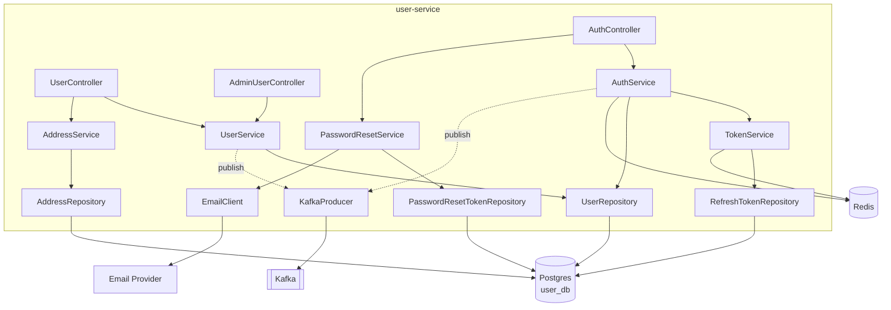

# User Service (HLD + LLD)

## Tóm tắt
User Service chạy port 8081, quản lý authentication (register/login/reset), profile, address book, và admin user management. DB riêng `user_db` PostgreSQL. Publish `UserRegistered`, `UserBlocked` event. Không consume event.

## Context Links
- Strategy: [../../strategy/services/user-business.md](../../strategy/services/user-business.md)
- Class diagram: [../03-class-diagrams.md#user-service-domain](../03-class-diagrams.md#user-service-domain)
- BA: [../../ba/uc-auth.md](../../ba/uc-auth.md), [../../ba/uc-user-profile.md](../../ba/uc-user-profile.md), [../../ba/uc-admin-user.md](../../ba/uc-admin-user.md)
- TS: [../../technical-spec/ts-auth.md](../../technical-spec/ts-auth.md)

## Component Diagram



## Responsibilities

| Responsibility | Endpoint |
|---|---|
| Register customer | POST `/api/v1/auth/register` |
| Login | POST `/api/v1/auth/login` |
| Refresh token | POST `/api/v1/auth/refresh` |
| Logout | POST `/api/v1/auth/logout` |
| Request password reset | POST `/api/v1/auth/password-reset/request` |
| Confirm password reset | POST `/api/v1/auth/password-reset/confirm` |
| Get my profile | GET `/api/v1/users/me` |
| Update my profile | PATCH `/api/v1/users/me` |
| Change my password | POST `/api/v1/users/me/password` |
| List my addresses | GET `/api/v1/users/me/addresses` |
| Add address | POST `/api/v1/users/me/addresses` |
| Update address | PATCH `/api/v1/users/me/addresses/{id}` |
| Delete address | DELETE `/api/v1/users/me/addresses/{id}` |
| Set default address | PUT `/api/v1/users/me/addresses/{id}/default` |
| [Admin] List users | GET `/api/v1/admin/users` |
| [Admin] Get user detail | GET `/api/v1/admin/users/{id}` |
| [Admin] Block user | POST `/api/v1/admin/users/{id}/block` |
| [Admin] Unblock user | POST `/api/v1/admin/users/{id}/unblock` |

## Database Schema

### Table `user`
| Column | Type | Constraint | Note |
|---|---|---|---|
| id | UUID | PK | UUID v7 |
| email | VARCHAR(255) | UNIQUE, NOT NULL | lowercase |
| password_hash | VARCHAR(255) | NOT NULL | bcrypt |
| full_name | VARCHAR(100) | NOT NULL | |
| phone | VARCHAR(20) | | VN format |
| avatar_url | VARCHAR(500) | | |
| role | VARCHAR(20) | NOT NULL | CUSTOMER/ADMIN |
| status | VARCHAR(20) | NOT NULL | ACTIVE/BLOCKED |
| blocked_reason | TEXT | | |
| blocked_by | UUID | | adminId |
| blocked_at | TIMESTAMP | | |
| created_at | TIMESTAMP | NOT NULL DEFAULT now() | |
| updated_at | TIMESTAMP | NOT NULL DEFAULT now() | |

Indexes: `idx_user_email (email)`, `idx_user_status (status)`.

### Table `address`
| Column | Type | Constraint |
|---|---|---|
| id | UUID | PK |
| user_id | UUID | FK → user(id), NOT NULL |
| recipient_name | VARCHAR(100) | NOT NULL |
| phone | VARCHAR(20) | NOT NULL |
| address_line1 | VARCHAR(255) | NOT NULL |
| ward | VARCHAR(100) | |
| district | VARCHAR(100) | NOT NULL |
| city | VARCHAR(100) | NOT NULL |
| is_default | BOOLEAN | NOT NULL DEFAULT false |
| created_at | TIMESTAMP | NOT NULL DEFAULT now() |

Indexes: `idx_address_user (user_id)`.

### Table `refresh_token`
| Column | Type | Constraint |
|---|---|---|
| id | UUID | PK |
| user_id | UUID | FK → user(id) |
| token_hash | VARCHAR(255) | NOT NULL, UNIQUE | SHA-256 hash |
| expires_at | TIMESTAMP | NOT NULL |
| revoked | BOOLEAN | NOT NULL DEFAULT false |
| created_at | TIMESTAMP | NOT NULL DEFAULT now() |

Indexes: `idx_refresh_user (user_id)`, `idx_refresh_hash (token_hash)`.

### Table `password_reset_token`
| Column | Type | Constraint |
|---|---|---|
| id | UUID | PK |
| user_id | UUID | FK → user(id) |
| token_hash | VARCHAR(255) | NOT NULL, UNIQUE |
| expires_at | TIMESTAMP | NOT NULL |
| used | BOOLEAN | NOT NULL DEFAULT false |
| created_at | TIMESTAMP | NOT NULL DEFAULT now() |

## Events Publish
- `user.user.registered` — topic: `user.registered`
  ```json
  { "userId": "uuid", "email": "x@y.com", "fullName": "Nguyen Van A", "registeredAt": "2026-04-21T10:00:00Z" }
  ```
- `user.user.blocked` — topic: `user.blocked`
- `user.user.unblocked` — topic: `user.unblocked`

## Events Consume
(Không consume ở MVP)

## External Dependencies
- **Email Provider** (SendGrid/SES): gửi welcome email, password reset link
- **Redis**: rate limit login, store login-fail counter

## Config (application.yml excerpt)
```yaml
server:
  port: 8081

spring:
  datasource:
    url: jdbc:postgresql://postgres-user:5432/user_db
  jpa:
    hibernate.ddl-auto: validate
  flyway:
    locations: classpath:db/migration
  kafka:
    bootstrap-servers: kafka:9092

jwt:
  secret: ${JWT_SECRET}
  access-ttl: PT1H
  refresh-ttl: P7D

auth:
  bcrypt-cost: 12
  login-fail-lock-threshold: 5
  login-fail-lock-window: PT15M
  login-fail-lock-duration: PT30M
  password-reset-ttl: PT15M
```

## Security Considerations
- Password: bcrypt cost 12, never log plain password
- JWT: secret từ env, rotate plan mỗi 90 ngày
- Refresh token: lưu hash (SHA-256), không lưu plain
- Rate limit: Redis counter + Gateway filter
- Input validation: Jakarta `@Valid`, email format, password strength
- SQL injection: JPA prepared statements (không raw SQL với user input)
- CSRF: stateless JWT → không cần CSRF token nhưng vẫn dùng SameSite cookie cho refresh

## Scalability
- Stateless service → scale horizontal (K8s HPA 2-5 pods)
- DB: read replica cho `GET /users/{id}` nếu cần (phase 2)
- Redis: cluster cho session nếu > 100k active users

## Monitoring
- Metrics: login success/fail rate, register rate, password reset rate
- Alerts: login fail spike (> 100/min across users → attack?), DB connection pool exhaustion

## SLO
- Availability: 99.5%
- P95 latency: GET /me < 100ms, POST /login < 300ms
- Error rate: < 0.5%
