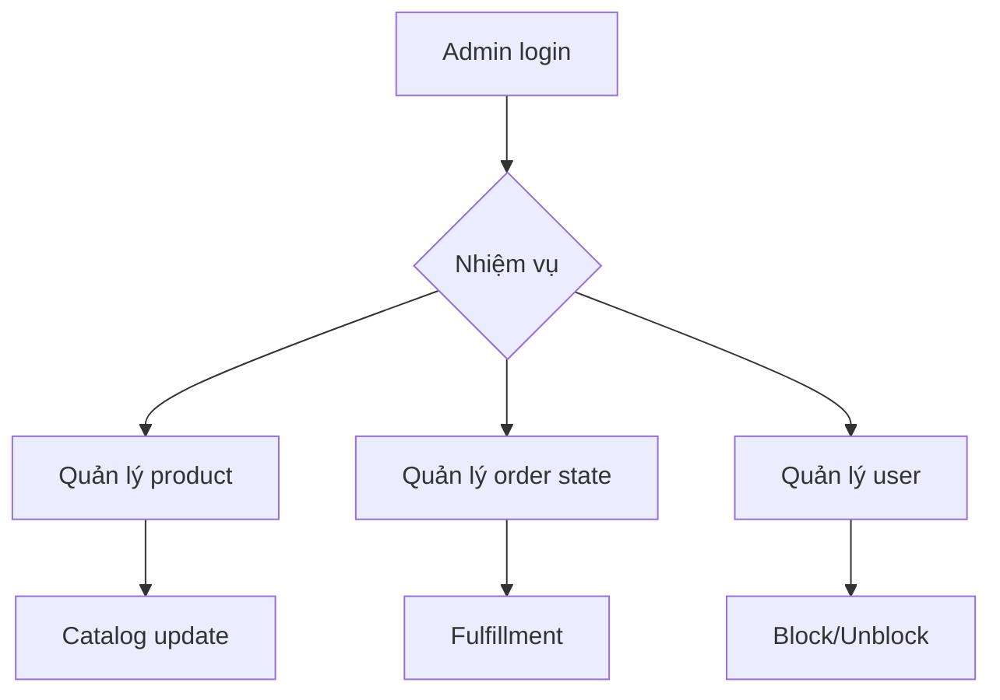

# User Journeys (v2)

## Tóm tắt
Mô tả hành trình Customer và Admin theo kiến trúc mới: API Gateway ở edge, payment/inventory/notification tách riêng khỏi order/product.

## Context Links
- Overview: [00-business-overview.md](./00-business-overview.md)
- Rules: [02-business-rules.md](./02-business-rules.md)
- BA index: [../ba/README.md](../ba/README.md)

## Customer Journey

## Touchpoints theo giai đoạn
| Giai đoạn | Customer action | Service chính |
|---|---|---|
| Discover/Browse | Tìm kiếm, xem chi tiết | product-service |
| Cart | Thêm/sửa/xóa giỏ | order-service + inventory-service (check khả dụng) |
| Checkout | Chọn địa chỉ, xác nhận đơn | order-service |
| Payment | Redirect VNPay hoặc COD | payment-service |
| Stock handling | Reserve/commit/release | inventory-service |
| Tracking | Theo dõi timeline đơn | order-service |
| Notification | Nhận email trạng thái | notification-service |
| Review | Viết đánh giá sau delivered | product-service |

## Admin Journey

## Admin touchpoints
| Persona | Mục tiêu | Service chính |
|---|---|---|
| Product Admin | CRUD catalog, category | product-service |
| Inventory Operator | Điều chỉnh tồn kho, xem low stock | inventory-service |
| Order Operator | Confirm/ship/deliver/refund | order-service + payment-service |
| CS/Admin User | Block/unblock user | user-service |

## Sự kiện quan trọng trên journey
| Milestone | Event | Consumer |
|---|---|---|
| User register | UserRegistered | notification-service |
| Order created | OrderPlaced | inventory-service, notification-service |
| Payment success/fail | PaymentSucceeded/PaymentFailed | order-service, notification-service |
| Order shipped/delivered | OrderShipped/OrderDelivered | notification-service, product-service (eligibility review) |

## Journey risks cần AI lưu ý
1. Double-submit checkout: bắt buộc idempotency key.
2. Race condition stock: chỉ inventory-service được commit mutation tồn kho.
3. Payment callback retry: payment-service phải idempotent.
4. Notification fail: không rollback order/payment; chỉ retry async.
