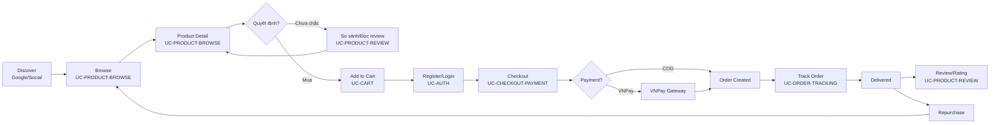
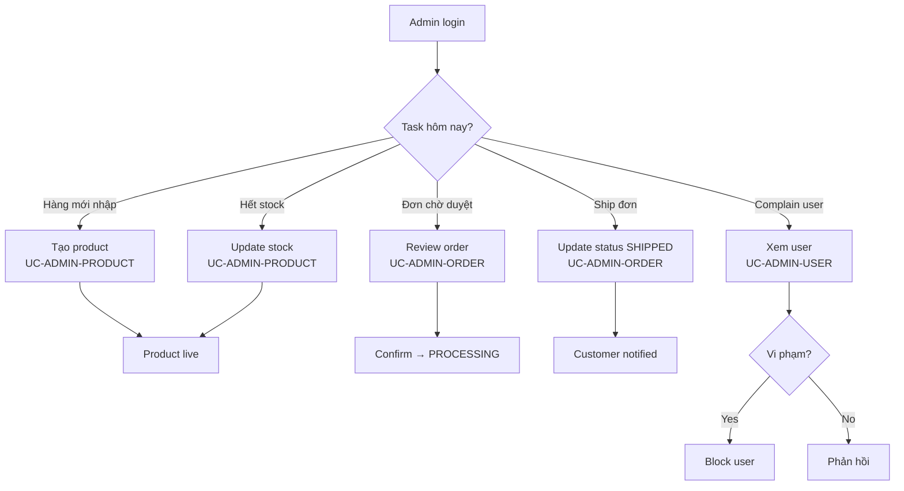

# User Journeys

## Tóm tắt
Mô tả hành trình của 2 nhóm user chính: **Customer** (discover → purchase → repurchase) và **Admin** (daily operations). Các touchpoint chính kết nối với UC trong `ba/` để AI map nhanh khi làm task.

## Context Links
- Business overview: [00-business-overview.md](./00-business-overview.md)
- Business rules: [02-business-rules.md](./02-business-rules.md)
- BA index: [../ba/README.md](../ba/README.md)

## Customer Journey — End-to-end

## Giai đoạn 1: Discover
| Step | Customer action | System response | UC liên quan |
|---|---|---|---|
| 1.1 | Tìm Google "iPhone 15 giá rẻ" | SEO landing page sản phẩm | UC-PRODUCT-BROWSE |
| 1.2 | Click Facebook ad | Landing sản phẩm với promo | UC-PRODUCT-BROWSE |
| 1.3 | Vào homepage | Hiển thị featured, new arrival, best-seller | UC-PRODUCT-BROWSE |

**Pain point**: nếu landing chậm > 3s → bounce rate tăng. **KPI**: p95 load <= 2.5s.

## Giai đoạn 2: Browse & Research
| Step | Action | System response | UC |
|---|---|---|---|
| 2.1 | Duyệt danh mục "Điện thoại" | List với filter (brand, giá, spec) | UC-PRODUCT-BROWSE |
| 2.2 | Lọc giá 10-20 triệu | Kết quả filter instant | UC-PRODUCT-BROWSE |
| 2.3 | Xem chi tiết 1 sản phẩm | Images, spec, price, stock, reviews | UC-PRODUCT-BROWSE |
| 2.4 | Đọc review | List review + rating breakdown | UC-PRODUCT-REVIEW |
| 2.5 | So sánh 2-3 sản phẩm | Comparison table (out-of-scope MVP) | - |

**Decision factor**: review >= 4 sao, stock còn, có sale.

## Giai đoạn 3: Purchase
| Step | Action | System response | UC |
|---|---|---|---|
| 3.1 | Add to cart | Badge cart update, mini-cart dropdown | UC-CART |
| 3.2 | View cart | Cart page với summary | UC-CART |
| 3.3 | Proceed checkout | Nếu guest → prompt login/register | UC-AUTH |
| 3.4 | Register/Login | Form đơn giản (email + password) | UC-AUTH |
| 3.5 | Chọn địa chỉ giao | Sổ địa chỉ hoặc nhập mới | UC-USER-PROFILE |
| 3.6 | Chọn payment | VNPay hoặc COD | UC-CHECKOUT-PAYMENT |
| 3.7 | Đặt hàng | Order tạo (PENDING), redirect VNPay hoặc confirm COD | UC-CHECKOUT-PAYMENT |
| 3.8 | Thanh toán VNPay | Gateway page, return callback | UC-CHECKOUT-PAYMENT |
| 3.9 | Confirm order | Email + màn hình success + mã đơn | UC-CHECKOUT-PAYMENT |

**Drop-off**: sau 3.3 (bắt buộc login) — cần optimize UX.

## Giai đoạn 4: Post-purchase
| Step | Action | System response | UC |
|---|---|---|---|
| 4.1 | Xem lịch sử đơn | List orders với status badge | UC-ORDER-TRACKING |
| 4.2 | Xem chi tiết đơn | Items, tracking timeline, invoice | UC-ORDER-TRACKING |
| 4.3 | Hủy đơn (nếu chưa confirm) | Hủy trong 1h, stock release | UC-ORDER-TRACKING |
| 4.4 | Nhận hàng | Status = DELIVERED | - |
| 4.5 | Viết review | Form rating + comment (chỉ order DELIVERED) | UC-PRODUCT-REVIEW |

## Giai đoạn 5: Repurchase
- Email newsletter với sản phẩm cùng category
- Remarketing ads
- Trở lại homepage → giai đoạn 2

## Admin Journey — Daily operations

## Admin touchpoint

| Persona | Tần suất | UC chính |
|---|---|---|
| Product Manager | Hằng ngày | UC-ADMIN-PRODUCT |
| Order Operator | Hằng ngày, real-time | UC-ADMIN-ORDER |
| Customer Support | On-demand | UC-ADMIN-USER, UC-ADMIN-ORDER |
| Inventory Manager | Daily batch | UC-ADMIN-PRODUCT (stock) |

## Cross-journey insights
- Customer cần notification (email + in-app) ở các milestone: order placed, paid, shipped, delivered
- Admin cần dashboard overview (today's orders, low stock alert) — backlog cho v1.1
- Guest checkout giảm drop-off 15-20% — ưu tiên v1.1
