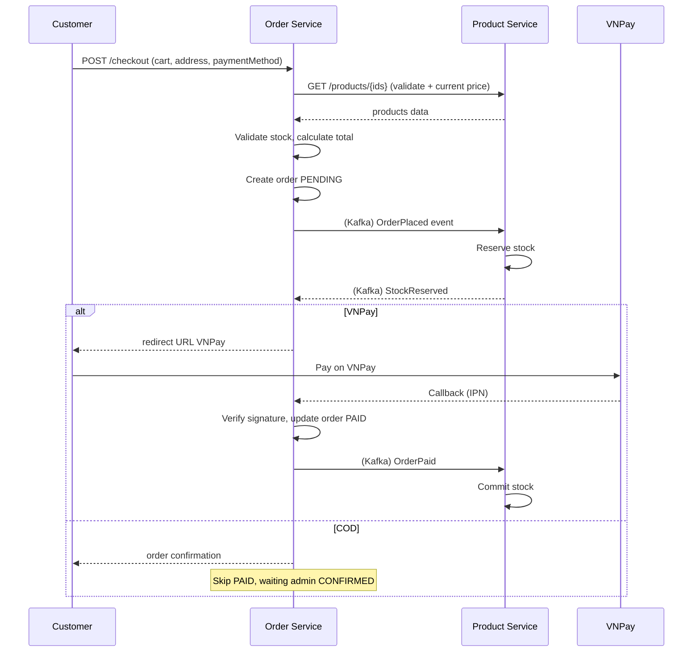

# Order Service — Business Strategy

## Tóm tắt
Order Service quản lý cart, checkout, order lifecycle, và payment (VNPay + COD). Đây là service phức tạp nhất do involve saga pattern với Product service (stock) và external VNPay gateway.

## Context Links
- Business rules (order, payment, refund): [../02-business-rules.md#br-order](../02-business-rules.md#br-order)
- Architecture: [../../architecture/services/order-service.md](../../architecture/services/order-service.md)
- BA: [../../ba/uc-cart.md](../../ba/uc-cart.md), [../../ba/uc-checkout-payment.md](../../ba/uc-checkout-payment.md), [../../ba/uc-order-tracking.md](../../ba/uc-order-tracking.md), [../../ba/uc-admin-order.md](../../ba/uc-admin-order.md)

## Responsibility
- Cart: add/update/remove item, sync cart khi login (merge local ↔ server)
- Checkout: validate cart, calculate total, create order, init payment
- Payment: VNPay redirect + callback, COD confirm
- Order lifecycle: state machine từ PENDING đến COMPLETED
- Admin: view/filter orders, update state, trigger refund

## Cart Rules

### Storage
- **Authenticated user**: lưu DB (`cart`, `cart_item` tables), persist across devices.
- **Guest**: lưu localStorage client-side ở MVP. Merge khi login.

### Rules
- Mỗi user 1 cart active (soft-delete khi checkout hoặc clear).
- Cart item: `productId`, `quantity`, `priceSnapshot`, `salePriceSnapshot`, `addedAt`.
- Quantity: integer >= 1, <= 10 (per item — MVP limit).
- Duplicate add (cùng productId): tăng quantity, không tạo row mới.
- Cart TTL: 30 ngày inactive → clear.

### Price sync
- Khi render cart: check current product `price`/`salePrice` vs `priceSnapshot`.
- Nếu khác → hiển thị warning "Giá sản phẩm đã thay đổi, vui lòng cập nhật".
- User click "Update price" → sync snapshot = current.
- Checkout tự dùng current price (không dùng snapshot) để đảm bảo giá đúng.

### Stock check
- Add to cart: check `product.stock > 0` (Product service API).
- Update cart quantity: check `quantity <= product.stock`.
- Checkout: final check + reserve.

## Checkout Flow

### Rules
1. Validate cart not empty
2. Validate address (address_id exists và thuộc user)
3. Validate all products ACTIVE và stock >= cart_quantity
4. Calculate:
   - subtotal = sum(item.effectivePrice × quantity)
   - shippingFee = theo BR-PRICING-05
   - codFee = theo BR-PAYMENT-04 (nếu COD)
   - total = subtotal + shippingFee + codFee
5. Create order PENDING với snapshot items, address, total
6. Publish `OrderPlaced` event → Product service reserve stock
7. Nếu VNPay: gen VNPay URL, return redirect.
8. Nếu COD: return order info, notify admin (Kafka).

### Idempotency
- Client gửi `Idempotency-Key` header (UUID). Server cache key → orderId trong Redis 24h.
- Trùng key → return order đã tạo, không tạo mới.

## VNPay Integration

### Parameters (per VNPay docs)
- `vnp_Version`: `2.1.0`
- `vnp_Command`: `pay`
- `vnp_TmnCode`: merchant code (env)
- `vnp_Amount`: total × 100
- `vnp_CurrCode`: `VND`
- `vnp_TxnRef`: order ID (unique per giao dịch)
- `vnp_OrderInfo`: "Thanh toan don hang {orderId}"
- `vnp_OrderType`: `other`
- `vnp_Locale`: `vn`
- `vnp_ReturnUrl`: `{BASE}/api/v1/payments/vnpay/return`
- `vnp_IpAddr`: client IP
- `vnp_CreateDate`: `yyyyMMddHHmmss`
- `vnp_ExpireDate`: createDate + 15 phút

### Signature
- Sort params ascending by key.
- Build query string: `key1=value1&key2=value2&...` (URL-encoded value).
- HMAC-SHA512(query, secretKey) → hex lowercase.
- Append `&vnp_SecureHash={hash}` vào URL.

### Return/IPN flow
1. User paid → VNPay redirect về `vnp_ReturnUrl` (browser) + call IPN (server-to-server).
2. **IPN là nguồn truth** (không phụ thuộc browser return — user có thể close tab).
3. IPN endpoint: verify signature, check `vnp_ResponseCode`:
   - `00`: success → update order PAID, publish `OrderPaid`
   - khác: fail → update order CANCELLED, release stock, publish `OrderCancelled`
4. Response IPN theo format VNPay: `{ "RspCode": "00", "Message": "Confirm Success" }`.
5. Idempotency: nếu order đã PAID → return RspCode `00` without re-update.

### Timeout
- VNPay hold payment 15 phút.
- Order auto-CANCELLED nếu PENDING > 30 phút (scheduled job mỗi 5 phút).

## Order Lifecycle Rules

### State machine
(Xem BR-ORDER, section "States" trong business-rules.md)

### Transition permissions

| From → To | Customer | Admin | System (auto) |
|---|---|---|---|
| PENDING → PAID | — | — | VNPay callback |
| PENDING → CONFIRMED | — | ✓ (COD order) | — |
| PENDING → CANCELLED | ✓ | ✓ | Timeout 30p |
| PAID → CONFIRMED | — | ✓ | — |
| CONFIRMED → PROCESSING | — | ✓ | — |
| PROCESSING → SHIPPED | — | ✓ | — |
| SHIPPED → DELIVERED | — | ✓ | Shipping API webhook (backlog) |
| DELIVERED → COMPLETED | — | — | Cron +7 ngày |
| DELIVERED → REFUNDED | — | ✓ | — |
| Any → CANCELLED (before CONFIRMED) | ✓ (pending) | ✓ | — |

### Audit trail
- Table `order_state_log`: orderId, fromState, toState, actorType (SYSTEM/USER/ADMIN), actorId, reason, at.
- Mọi transition → row mới + Kafka event `OrderStateChanged`.

## Fulfillment

### Shipping
- Shipper tích hợp ngoài phạm vi MVP (manual Admin nhập `trackingCode` + carrier).
- `trackingUrl`: auto gen từ carrier (GHN, GHTK, ViettelPost) theo template.

### Invoice
- Gen PDF sau state CONFIRMED.
- Fields: order info, items, customer, address, VAT 10%, total.
- Lưu S3, serve presigned URL cho customer download (TTL 7 ngày).

## Refund (BR-REFUND)
- Customer request refund qua form (contact support ở MVP, backlog: in-app form).
- Admin duyệt qua admin UI: order state → REFUNDED, ghi reason.
- Refund amount = order total (trừ shippingFee nếu customer change mind).
- Refund method: manual process ở MVP (admin chuyển khoản/hoàn VNPay tay).

## Events Publish
- `OrderPlaced` — orderId, userId, items[], total, paymentMethod, createdAt
- `OrderPaid` — orderId, paidAt, paymentInfo
- `OrderConfirmed` — orderId, confirmedBy, confirmedAt
- `OrderProcessing` — orderId
- `OrderShipped` — orderId, trackingCode, carrier, shippedAt
- `OrderDelivered` — orderId, deliveredAt
- `OrderCancelled` — orderId, reason, cancelledBy
- `OrderRefunded` — orderId, refundedAmount, reason
- `OrderStateChanged` — generic envelope cho mọi transition (để listener simple)

## Events Consume
- `StockReserved` (from Product) — confirm có thể tiếp tục flow
- `StockReservationFailed` (from Product) — auto cancel order, refund nếu đã paid
- `UserBlocked` (from User) — cancel all pending orders của user đó (backlog)

## KPI
- Checkout success rate: >= 92% (checkout attempts → order PENDING)
- Payment success rate: >= 95% (order PENDING → PAID)
- Average time to deliver: <= 2.5 ngày
- Cancellation rate: <= 8%
- Refund rate: <= 2%
