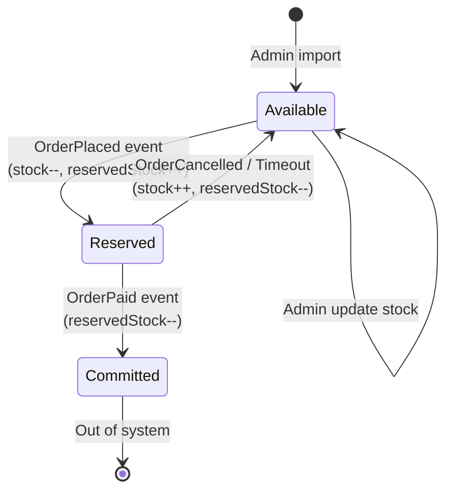

# Product Service — Business Strategy

## Tóm tắt
Product Service quản lý catalog (product, category), tồn kho (stock), review/rating. Scope: CRUD product, search/filter, stock lifecycle (reserve/commit/release), review chỉ cho order DELIVERED.

## Context Links
- Business rules (product, inventory, review): [../02-business-rules.md#br-product](../02-business-rules.md#br-product)
- Architecture: [../../architecture/services/product-service.md](../../architecture/services/product-service.md)
- BA: [../../ba/uc-product-browse.md](../../ba/uc-product-browse.md), [../../ba/uc-product-review.md](../../ba/uc-product-review.md), [../../ba/uc-admin-product.md](../../ba/uc-admin-product.md)

## Responsibility
- Catalog: CRUD product, CRUD category (admin only)
- Search/filter/sort product (customer)
- Stock management: reserve/commit/release (event-driven với Order service)
- Review/Rating: post review (chỉ cho order DELIVERED), compute average rating

## Catalog Rules

### Product
- Fields chính: `id`, `sku`, `slug`, `name`, `brand`, `categoryId`, `description`, `price`, `salePrice`, `stock`, `reservedStock`, `images[]`, `specs` (JSONB), `status`, `rating`, `reviewCount`, `createdAt`, `updatedAt`.
- **SKU**: unique, format `{BRAND}-{MODEL}-{VARIANT}`, admin input.
- **Slug**: auto từ `name`, ASCII, kebab-case, unique. VD "iPhone 15 Pro" → `iphone-15-pro`. Duplicate → append `-2`, `-3`.
- **Status**: DRAFT (admin đang soạn), ACTIVE (hiển thị), INACTIVE (ẩn), OUT_OF_STOCK (stock=0, hiển thị nhưng disable mua).
- **Images**: array URL, primary = index 0. Max 10. Lưu S3, serve qua CloudFront.
- **Specs**: JSON tự do theo category:
  - Phone: `{ ram, storage, screen_size, screen_resolution, battery, camera_main, chip, os }`
  - Laptop: `{ cpu, ram, ssd, screen_size, gpu, os, weight }`
  - Smartwatch: `{ display, battery_life, water_resistance, connectivity, compatibility }`
  - Accessory: `{ type, compatibility, color }`

### Category
- 2-level tree: root (VD "Điện thoại") → child (VD "iPhone", "Samsung", "Xiaomi").
- Fields: `id`, `parentId` (null = root), `name`, `slug`, `icon`, `sortOrder`.
- Root categories ở MVP: Điện thoại, Laptop, Đồng hồ thông minh, Phụ kiện.
- Product luôn thuộc child category (leaf). Root category chỉ hiển thị menu.

### Pricing
- `price`: giá gốc (BR-PRICING-01, -02).
- `salePrice`: nullable, phải < `price`. Khi set → hiển thị strikethrough `price`, áp dụng `salePrice`.
- Không có promotion code ở MVP.
- Currency: VND, integer (không có số thập phân).

## Search & Filter Rules

### Search
- Full-text search trên `name` + `brand` + `description`.
- PostgreSQL FTS với `tsvector` (MVP) hoặc Elasticsearch (backlog).
- Case-insensitive, bỏ dấu tiếng Việt (normalize).
- Tối thiểu 2 ký tự mới search.

### Filter
- `category`: 1 value (slug)
- `brand`: multi-value
- `priceMin`, `priceMax`: integer
- `rating`: >= value (VD >= 4)
- `inStock`: boolean (true = `stock > 0`)

### Sort
- `price`: asc/desc
- `createdAt`: desc (mới nhất — default)
- `rating`: desc
- `soldCount`: desc (best-seller — backlog field)

### Pagination
- Page size: 20 default, max 50
- Cursor-based (backlog) hoặc offset-based (MVP)

## Stock Lifecycle

### States
- `stock`: số available thực tế
- `reservedStock`: tổng số đã reserve cho PENDING orders

### Rules (BR-INVENTORY)
- `stock >= 0`, `reservedStock >= 0` (DB check constraint).
- Check out-of-stock: `stock == 0`.
- Low stock alert cho admin: `stock <= 5`.
- Banner khách: "Còn X sản phẩm" khi `stock <= 10`.
- Audit log: mọi stock change ghi vào `stock_log` (who, when, delta, reason).

### Event-driven stock sync
- Consume `OrderPlaced` → reserve stock per item (transactional).
- Consume `OrderPaid` → commit (xoá reservedStock).
- Consume `OrderCancelled` → release (trả lại stock).
- Nếu reserve fail (không đủ stock) → publish `StockReservationFailed` → Order service cancel order.

## Review Rules (BR-REVIEW)

### Eligibility
- User phải có order state = DELIVERED (hoặc COMPLETED) chứa sản phẩm.
- 1 user x 1 product x 1 order = 1 review.
- Check eligibility: gọi Order service API `GET /api/v1/orders/eligibility/{userId}/{productId}` hoặc consume `OrderDelivered` event để build local table `review_eligibility`.

### Content
- Rating: integer 1-5, required.
- Comment: string 0-1000 ký tự, optional.
- Images: backlog (phase 2).

### Display
- Hiển thị ngay không duyệt (BR-REVIEW-04).
- Admin có thể hide (field `isHidden`, default false).
- Pagination 10/page, sort by createdAt desc hoặc helpful (backlog).

### Aggregate
- `rating` (product) = avg(review.rating), làm tròn 1 chữ số (VD 4.3).
- `reviewCount` = count reviews không hidden.
- Rebuild async khi có review mới (job).

## Events Publish
- `ProductCreated` — `productId`, `sku`, `name`, `categoryId`, `price`, `createdAt`
- `ProductUpdated` — `productId`, `changedFields`, `updatedAt`
- `ProductActivated` / `ProductDeactivated` — `productId`
- `StockReserved` — `productId`, `quantity`, `orderId`
- `StockCommitted` — `productId`, `quantity`, `orderId`
- `StockReleased` — `productId`, `quantity`, `orderId`
- `StockReservationFailed` — `productId`, `quantity`, `orderId`, `reason`
- `ReviewPosted` — `reviewId`, `productId`, `userId`, `rating`

## Events Consume
- `OrderPlaced` (from Order) → reserve stock
- `OrderPaid` (from Order) → commit stock
- `OrderCancelled` (from Order) → release stock
- `OrderDelivered` (from Order) → mark product as reviewable

## KPI
- Search result relevance: >= 70% click-through top 5 results
- Stock accuracy: 99.95% (physical vs system)
- Review fraud rate: < 1% (monitor by admin)
- Product load p95: <= 500ms (single product API)
