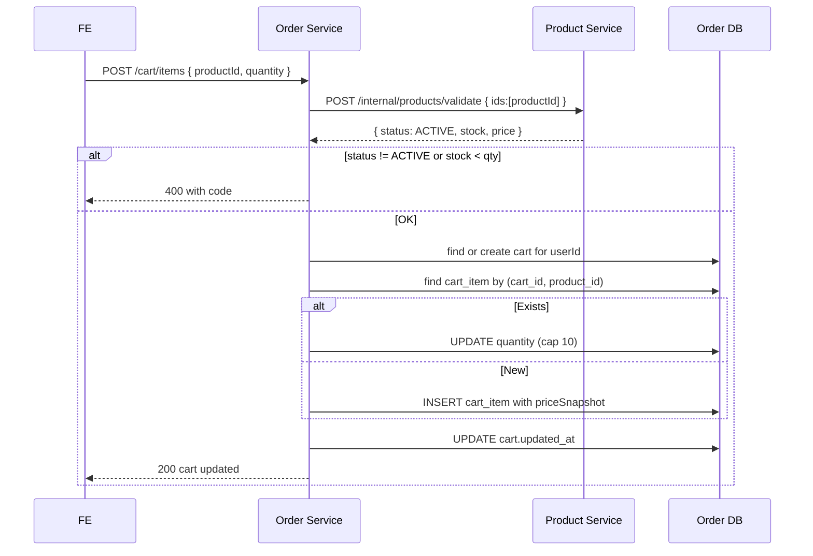

# TS-CART: Giỏ hàng

## Tóm tắt
Impl spec cho UC-CART. Service: **Order** (cart table + logic), call **Product** để validate + get current price. Guest cart = localStorage (Zustand persist). Merge khi login.

## Context Links
- BA Spec: [../ba/uc-cart.md](../ba/uc-cart.md)
- Services affected: ✅ Order | ✅ Product | ⬜ User
- Architecture: [../architecture/services/order-service.md](../architecture/services/order-service.md)

## API Contracts

### GET /api/v1/cart
Requires auth.

**Response 200**
```json
{
  "id": "uuid",
  "items": [
    {
      "productId": "uuid",
      "productName": "iPhone 15 Pro",
      "productImage": "...",
      "quantity": 2,
      "priceSnapshot": 28990000,
      "salePriceSnapshot": 26990000,
      "effectivePriceSnapshot": 26990000,
      "currentPrice": 27990000,
      "currentSalePrice": 25990000,
      "effectiveCurrentPrice": 25990000,
      "priceChanged": true,
      "stock": 15,
      "stockSufficient": true,
      "lineSubtotalCurrent": 51980000
    }
  ],
  "subtotalCurrent": 51980000,
  "itemCount": 2,
  "updatedAt": "..."
}
```

### POST /api/v1/cart/items
**Request**
```json
{ "productId": "uuid", "quantity": 1 }
```

**Response 200** — cart updated

**Errors**:
- 400 `PRODUCT_UNAVAILABLE`, `OUT_OF_STOCK`, `INSUFFICIENT_STOCK`, `QUANTITY_EXCEEDS_LIMIT` (>10)

### PATCH /api/v1/cart/items/{productId}
**Request**: `{ "quantity": 3 }`
**Response 200** — cart updated

### DELETE /api/v1/cart/items/{productId}
**Response 200** — cart updated

### DELETE /api/v1/cart
Clear all items. **Response 204**

### POST /api/v1/cart/merge
Merge guest cart (from login).
**Request**
```json
{ "items": [{ "productId": "uuid", "quantity": 2 }] }
```
**Response 200** — merged cart

## Database Changes

### Migration V1__create_cart.sql (Order DB)
```sql
CREATE TABLE cart (
    id UUID PRIMARY KEY,
    user_id UUID NOT NULL UNIQUE,
    created_at TIMESTAMP NOT NULL DEFAULT now(),
    updated_at TIMESTAMP NOT NULL DEFAULT now()
);

CREATE TABLE cart_item (
    id UUID PRIMARY KEY,
    cart_id UUID NOT NULL REFERENCES cart(id) ON DELETE CASCADE,
    product_id UUID NOT NULL,
    product_name VARCHAR(200),
    product_image VARCHAR(500),
    quantity INT NOT NULL CHECK (quantity BETWEEN 1 AND 10),
    price_snapshot BIGINT NOT NULL,
    sale_price_snapshot BIGINT,
    added_at TIMESTAMP NOT NULL DEFAULT now(),
    UNIQUE (cart_id, product_id)
);
CREATE INDEX idx_cart_item_cart ON cart_item(cart_id);
```

## Internal API (Product Service)

### POST /api/v1/internal/products/validate
Called by Order Service during checkout/cart.

**Request**
```json
{ "ids": ["uuid1", "uuid2"] }
```

**Response 200**
```json
{
  "data": [
    { "id": "uuid1", "name": "...", "primaryImage": "...", "price": 28990000, "salePrice": 26990000, "effectivePrice": 26990000, "stock": 15, "status": "ACTIVE" }
  ]
}
```

## Sequence



## Class/Component Design

### Backend — Order Service
```java
@RestController
@RequestMapping("/api/v1/cart")
public class CartController {
    @GetMapping public CartResponse get();
    @PostMapping("/items") public CartResponse addItem(@Valid @RequestBody AddCartItemRequest req);
    @PatchMapping("/items/{productId}") public CartResponse updateItem(@PathVariable UUID productId, @Valid @RequestBody UpdateCartItemRequest req);
    @DeleteMapping("/items/{productId}") public CartResponse removeItem(@PathVariable UUID productId);
    @DeleteMapping public ResponseEntity<Void> clear();
    @PostMapping("/merge") public CartResponse merge(@Valid @RequestBody MergeCartRequest req);
}

@Service
public class CartService {
    public Cart getByUser(UUID userId);
    public Cart addItem(UUID userId, UUID productId, int quantity);
    public Cart updateItem(UUID userId, UUID productId, int quantity);
    public Cart removeItem(UUID userId, UUID productId);
    public void clear(UUID userId);
    public Cart merge(UUID userId, List<MergeCartItem> guestItems);

    private Cart getOrCreate(UUID userId);
    private void validateProductAndStock(UUID productId, int quantity); // call Product Service
}

@Component
public class ProductServiceClient {
    public List<ProductValidationInfo> validate(List<UUID> ids);
    public ProductValidationInfo getOne(UUID id);
    // với Resilience4j CircuitBreaker + Retry + Timeout
}
```

### Frontend
- Pages: `/cart`
- Components:
  - `CartDrawer.tsx` (slide-in)
  - `CartItem.tsx`
  - `CartSummary.tsx`
  - `CartHeader.tsx` (icon with badge)
  - `PriceChangeBanner.tsx`
- Hooks: `useCart.ts` (React Query + optimistic updates)
- Stores: `cart.store.ts` (Zustand persist cho guest)

```typescript
// stores/cart.store.ts (guest only)
interface GuestCartState {
  items: { productId: string; quantity: number; productName: string; price: number; image: string }[];
  add, remove, update, clear, merge;
}
export const useGuestCartStore = create(persist(...));
```

## Implementation Steps

### Backend — Product Service (add internal endpoint)
1. [ ] Add `ProductValidationInfo` DTO
2. [ ] Add `InternalProductController.validate(List<UUID> ids)`
3. [ ] Test internal endpoint

### Backend — Order Service
1. [ ] Create Spring Boot project `order-service`
2. [ ] Migration V1 (cart, cart_item)
3. [ ] Entities + Repositories
4. [ ] `ProductServiceClient` với WebClient/RestTemplate + Resilience4j config
5. [ ] `CartService` với all CRUD
6. [ ] `CartController`
7. [ ] Unit test (mock ProductServiceClient)
8. [ ] Integration test với Testcontainers + WireMock cho Product Service

### Frontend
1. [ ] Types `types/cart.ts`
2. [ ] API client `lib/api/cart.api.ts`
3. [ ] `useCart` React Query hook
4. [ ] Guest cart store (Zustand + persist)
5. [ ] `CartHeader` icon (badge auto from store/query)
6. [ ] `CartDrawer` với animations
7. [ ] `CartItem` (quantity stepper with debounce)
8. [ ] `CartSummary` sidebar
9. [ ] Page `/cart`
10. [ ] Login hook: merge guest → server on login
11. [ ] E2E: add to cart (guest + auth) → merge → update → checkout button

## Test Strategy
- Unit: CartService logic (max 10, duplicate product → increment)
- Integration: cart operations with real DB + mocked Product Service
- E2E: full cart flows

## Edge Cases
1. **User call APIs nhanh (add + update simultaneously)**: dùng `@Transactional` + row lock cart_item.
2. **Product INACTIVE giữa lúc user có trong cart**: GET /cart vẫn return item với warning; checkout sẽ fail.
3. **Guest cart lớn (> 50 items)**: localStorage giới hạn ~5MB OK nhưng UX xấu. Warn > 20 items.
4. **Merge guest cart với server cart có overlap**: quantity = min(guest + server, 10). Không cộng raw.
5. **Product Service down**: Resilience4j fallback → cho phép add với warning "Không thể verify stock, kiểm tra lại ở checkout". Hoặc block với 503.
6. **Price change giữa add và view**: priceSnapshot cũ, currentPrice mới — FE show banner, checkout dùng current.
7. **Stock decrease giữa view và checkout**: re-check ở checkout, fail với specific code.
8. **User có 2 tabs**: cart sync qua React Query refetch on focus (window focus).
9. **Cart TTL 30 ngày**: scheduled job xóa inactive carts.
10. **productImage URL change**: cart_item lưu snapshot khi add. Update nếu product update ảnh? MVP: keep snapshot (consistency). Backlog: refresh khi render.
