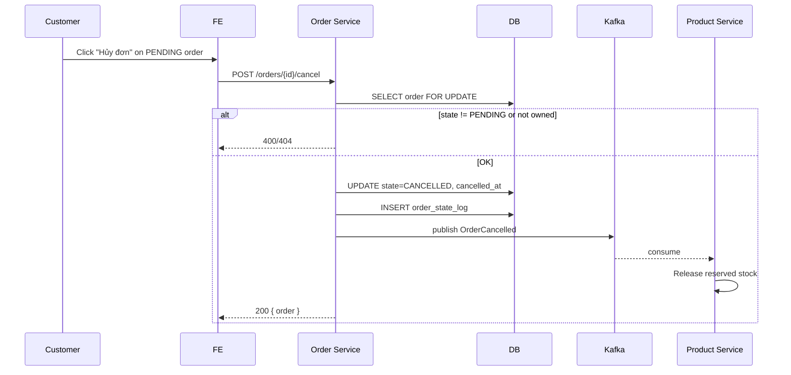

# TS-ORDER-TRACKING: Order History / Detail / Tracking / Cancel

## Tóm tắt
Impl spec cho UC-ORDER-TRACKING. Service: **Order** only (read + customer cancel). Endpoints: GET /orders (list), GET /orders/{id}, POST /orders/{id}/cancel.

## Context Links
- BA Spec: [../ba/uc-order-tracking.md](../ba/uc-order-tracking.md)
- Services affected: ✅ Order | ⬜ User | ⬜ Product
- Architecture: [../architecture/services/order-service.md](../architecture/services/order-service.md)

## API Contracts

### GET /api/v1/orders
Requires auth.
**Query**:
- `state` (comma-separated)
- `tab` (pending|shipping|completed|cancelled) — alias filter
- `page`, `size`, `sort` (default createdAt,desc)

**Response 200**
```json
{
  "data": [
    {
      "id": "uuid",
      "orderCode": "...",
      "state": "SHIPPED",
      "stateLabel": "Đang giao",
      "total": 26990000,
      "itemsPreview": [
        { "name": "iPhone 15 Pro", "image": "...", "quantity": 1 }
      ],
      "itemsMoreCount": 0,
      "createdAt": "..."
    }
  ],
  "meta": { "page": 0, "size": 10, "total": 42 }
}
```

### GET /api/v1/orders/{id}
Requires auth. Must belong to user.

**Response 200**
```json
{
  "id": "uuid",
  "orderCode": "...",
  "state": "SHIPPED",
  "items": [...],
  "subtotal": ..., "shippingFee": ..., "codFee": ..., "total": ...,
  "shippingAddress": {...},
  "paymentMethod": "VNPAY",
  "payment": { "vnpTransactionNo": "...", "vnpPayDate": "..." },
  "trackingCode": "...", "carrier": "GHN", "trackingUrl": "https://...",
  "timeline": [
    { "state": "PENDING", "at": "..." },
    { "state": "PAID", "at": "..." }
  ],
  "canCancel": false,
  "canReviewItems": [
    { "productId": "uuid", "canReview": true }
  ]
}
```

**Errors**: 404 (not found OR not owned — cùng response để tránh leak)

### POST /api/v1/orders/{id}/cancel
Requires auth.

**Request**: `{ "reason": "..." }` (optional)

**Response 200** — updated order

**Errors**: 400 `INVALID_STATE_TRANSITION` với currentState + allowedTransitions

## Database Changes
(Không có — dùng tables từ TS-CHECKOUT-PAYMENT)

## Event Contracts

### Publish (from cancel): order.order.cancelled
Đã cover trong TS-CHECKOUT-PAYMENT.

## Sequence



## Class/Component Design

### Backend
```java
@Service
public class OrderQueryService {
    public Page<OrderSummary> listMine(UUID userId, OrderListQuery query, Pageable pageable);
    public OrderDetail getMine(UUID userId, UUID orderId);
    private String buildTrackingUrl(String carrier, String code);
}

@Service
public class CustomerCancelService {
    @Transactional
    public Order cancel(UUID userId, UUID orderId, String reason);
}
```

### Frontend
- Pages:
  - `/account/orders` — list with tabs
  - `/account/orders/{id}` — detail with timeline
- Components:
  - `OrderStatusBadge.tsx`
  - `OrderCard.tsx` (list item)
  - `OrderTimeline.tsx` (visual stepper)
  - `CancelOrderDialog.tsx`
  - `TrackingLink.tsx`
- Hook: `useOrders`, `useOrder`

## Implementation Steps

### Backend
1. [ ] `OrderQueryService.listMine` với Specifications filter
2. [ ] `OrderQueryService.getMine` — join items + state log
3. [ ] Helper `buildTrackingUrl(carrier, code)` map per carrier
4. [ ] Helper `canCancel(order)` — state == PENDING
5. [ ] Helper `canReviewItem(userId, productId, orderId)` — call Product Service internal endpoint OR maintain local eligibility cache
6. [ ] `CustomerCancelService` — check state + publish event
7. [ ] OrderController endpoints
8. [ ] Unit tests (state machine transitions, helper logic)
9. [ ] Integration test — full list + cancel flow

### Frontend
1. [ ] Types
2. [ ] API client
3. [ ] `useOrders` list + filter
4. [ ] `useOrder` detail
5. [ ] `OrderStatusBadge` colors + labels
6. [ ] `OrderCard` list item
7. [ ] Tab filter component
8. [ ] `OrderTimeline` visual
9. [ ] `CancelOrderDialog` confirm
10. [ ] Pages implementation
11. [ ] E2E: browse orders, filter by tab, detail, cancel PENDING

## Test Strategy

### Unit
- OrderQueryService filter combinations
- canCancel logic (only PENDING)
- buildTrackingUrl all carriers

### Integration
- GET /orders returns only user's own orders (security)
- Cancel flow: state transition + stock released (verify via Product Service consumer)

### E2E
- Customer views order history, filter tabs, cancel PENDING, tracking link opens external tab

## Edge Cases

1. **Security: user A xem order B**: verify `order.userId == JWT.userId` ở query level, không chỉ return 403 (return 404 để không leak existence).
2. **Cancel race**: user click cancel 2 lần nhanh — second request finds state=CANCELLED → return 400 INVALID_STATE_TRANSITION hoặc idempotent 200.
3. **Cancel sau CONFIRMED**: blocked. Instruction message: "Đơn đã xử lý, liên hệ hotline."
4. **Timeline missing states**: nếu order went directly PENDING → CANCELLED (via timeout), timeline chỉ có 2 entries. UI render OK.
5. **TrackingCode missing**: carrier may not gen immediately. UI show "Chờ cập nhật mã vận đơn".
6. **canReviewItems performance**: nếu order có 10 items → 10 round trip gọi Product Service? Batch: OrderDetail return với `items[].canReview` pre-filled từ join với review_eligibility cache local OR single batch call.
7. **Order filter by date range** (backlog UI): BE support via query param `?from=&to=`.
8. **Order list pagination cursor vs offset**: MVP offset OK. Phase 2 cursor cho large history.
9. **Deleted product in historical order**: order_item snapshot có productName + image → vẫn hiển thị OK.
10. **Email notification per state change**: done via Kafka consumer service (backlog dedicated notification-service; MVP: simple @Async email trong order-service per state transition).
