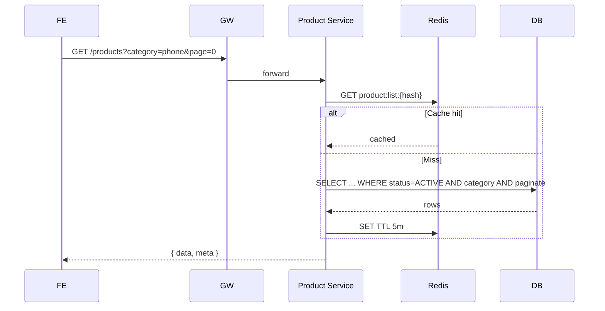

# TS-PRODUCT-BROWSE: Duyệt/Tìm/Lọc/Chi tiết

## Tóm tắt
Impl spec cho UC-PRODUCT-BROWSE. Service: **Product** only (public). Endpoints: GET products (list + filter + sort), GET products/{slug}, GET products/search, GET categories, GET categories/tree. Cache Redis. Search: PostgreSQL FTS với unaccent.

## Context Links
- BA Spec: [../ba/uc-product-browse.md](../ba/uc-product-browse.md)
- Services affected: ✅ Product | ⬜ User | ⬜ Order
- Architecture: [../architecture/services/product-service.md](../architecture/services/product-service.md)

## API Contracts

### GET /api/v1/products
Public. Cache 5 min per query.

**Query params**
- `category` (string, slug)
- `brand` (comma-separated)
- `priceMin`, `priceMax` (integer)
- `rating` (1-5, >=)
- `inStock` (boolean, default false = no filter)
- `sort` (field,direction) — default `createdAt,desc`. Allowed: `createdAt`, `price`, `rating`, `soldCount`
- `page` (default 0), `size` (default 20, max 50)

**Response 200**
```json
{
  "data": [
    {
      "id": "uuid",
      "slug": "iphone-15-pro-256gb",
      "name": "iPhone 15 Pro 256GB",
      "brand": "Apple",
      "category": { "id": "uuid", "name": "iPhone", "slug": "iphone" },
      "price": 28990000,
      "salePrice": 26990000,
      "effectivePrice": 26990000,
      "rating": 4.7,
      "reviewCount": 128,
      "stock": 15,
      "inStock": true,
      "primaryImage": "https://cdn.../1.jpg"
    }
  ],
  "meta": { "page": 0, "size": 20, "total": 42 }
}
```

### GET /api/v1/products/{slug}
**Response 200** — full product (xem format UC-PRODUCT-BROWSE Flow D)
**Errors**: 404 PRODUCT_NOT_FOUND (includes INACTIVE for public)

### GET /api/v1/products/search
**Query**: `q` (required, min 2 chars), + same as list

**Response 200** — same structure as list, `data` may include `matchScore` (backlog)

### GET /api/v1/categories
**Response 200**
```json
{ "data": [{ "id": "uuid", "parentId": null, "name": "Điện thoại", "slug": "dien-thoai", "icon": "...", "sortOrder": 0 }] }
```

### GET /api/v1/categories/tree
**Response 200**
```json
{ "data": [{ "id": "...", "name": "Điện thoại", "slug": "...", "children": [{ "id": "...", "name": "iPhone", ... }] }] }
```
Cache 1h.

### GET /api/v1/products/{id}/reviews
**Query**: `page`, `size`, `sort` (default `createdAt,desc`)
**Response 200** — xem UC-PRODUCT-REVIEW format

## Database Changes

### Migration V1__create_product_tables.sql
```sql
CREATE EXTENSION IF NOT EXISTS unaccent;
CREATE EXTENSION IF NOT EXISTS pg_trgm;

CREATE TABLE category (
    id UUID PRIMARY KEY,
    parent_id UUID REFERENCES category(id),
    name VARCHAR(100) NOT NULL,
    slug VARCHAR(100) NOT NULL UNIQUE,
    icon VARCHAR(200),
    sort_order INT DEFAULT 0,
    created_at TIMESTAMP NOT NULL DEFAULT now()
);

CREATE TABLE product (
    id UUID PRIMARY KEY,
    sku VARCHAR(50) NOT NULL UNIQUE,
    slug VARCHAR(200) NOT NULL UNIQUE,
    name VARCHAR(200) NOT NULL,
    brand VARCHAR(50) NOT NULL,
    category_id UUID NOT NULL REFERENCES category(id),
    description TEXT,
    price BIGINT NOT NULL CHECK (price >= 0),
    sale_price BIGINT CHECK (sale_price IS NULL OR sale_price < price),
    stock INT NOT NULL DEFAULT 0 CHECK (stock >= 0),
    reserved_stock INT NOT NULL DEFAULT 0 CHECK (reserved_stock >= 0),
    images TEXT[] NOT NULL DEFAULT '{}',
    specs JSONB NOT NULL DEFAULT '{}',
    status VARCHAR(20) NOT NULL DEFAULT 'DRAFT',
    rating NUMERIC(3,1) DEFAULT 0,
    review_count INT DEFAULT 0,
    created_at TIMESTAMP NOT NULL DEFAULT now(),
    updated_at TIMESTAMP NOT NULL DEFAULT now()
);
CREATE INDEX idx_product_status ON product(status);
CREATE INDEX idx_product_category ON product(category_id, status);
CREATE INDEX idx_product_slug ON product(slug);
CREATE INDEX idx_product_search ON product USING GIN (to_tsvector('simple', unaccent(name || ' ' || brand)));
```

## Event Contracts
(No events published from these read endpoints; see TS-ADMIN-PRODUCT for CRUD events)

## Sequence



## Class/Component Design

### Backend — Product Service
```java
@RestController
@RequestMapping("/api/v1/products")
public class ProductController {
    @GetMapping public ProductListResponse list(@Valid ProductListQuery query);
    @GetMapping("/{slug}") public ProductDetailResponse getBySlug(@PathVariable String slug);
    @GetMapping("/search") public ProductListResponse search(@RequestParam String q, @Valid ProductListQuery query);
}

@RestController
@RequestMapping("/api/v1/categories")
public class CategoryController {
    @GetMapping public CategoryListResponse list();
    @GetMapping("/tree") public CategoryTreeResponse tree();
}

@Service
public class ProductQueryService {
    @Cacheable(value="product-list", key="#query.hash()")
    public Page<ProductSummary> list(ProductListQuery query);

    @Cacheable(value="product-detail", key="#slug")
    public ProductDetail getBySlug(String slug);

    public Page<ProductSummary> search(String q, ProductListQuery query);
}

@Repository
public interface ProductRepository extends JpaRepository<Product, UUID>, JpaSpecificationExecutor<Product> {
    Optional<Product> findBySlugAndStatus(String slug, ProductStatus status);
}
```

#### Dynamic query với Specifications
```java
public class ProductSpecs {
    public static Specification<Product> statusActive();
    public static Specification<Product> byCategorySlug(String slug);
    public static Specification<Product> byBrands(List<String> brands);
    public static Specification<Product> priceBetween(Long min, Long max);
    public static Specification<Product> ratingAtLeast(BigDecimal min);
    public static Specification<Product> inStock();
    public static Specification<Product> search(String keyword); // FTS query
}
```

### Frontend
- Pages:
  - `/` → `app/page.tsx` (SSG + revalidate 5m)
  - `/category/[slug]` → `app/(shop)/category/[slug]/page.tsx`
  - `/product/[slug]` → `app/(shop)/product/[slug]/page.tsx`
  - `/search` → `app/(shop)/search/page.tsx`
- Components:
  - `ProductCard.tsx`, `ProductGrid.tsx`, `ProductGallery.tsx`, `ProductFilter.tsx`, `ProductSort.tsx`
  - `CategoryNav.tsx`, `Breadcrumb.tsx`
  - `SearchBar.tsx` (debounced autocomplete)
- API: `lib/api/product.api.ts`
- Hooks: `useProducts.ts` (React Query wrapper)

## Implementation Steps

### Backend
1. [ ] Create Spring Boot project `product-service`
2. [ ] Migration V1 (tables, indexes, extensions)
3. [ ] Entities: `Product`, `Category`
4. [ ] Enum `ProductStatus`
5. [ ] Repositories với JpaSpecificationExecutor
6. [ ] `ProductSpecs` static methods
7. [ ] `ProductQueryService` với `@Cacheable`
8. [ ] Configure Redis `CacheManager`
9. [ ] `CategoryService.getTree()` với recursive build
10. [ ] Controllers + DTOs (ProductSummary, ProductDetail, ...)
11. [ ] Global exception handler
12. [ ] OpenAPI annotations
13. [ ] Seed data: 4 root categories + 20 products per category (script hoặc Flyway V99)
14. [ ] Unit tests: Specs logic, cache key hash
15. [ ] Integration test với Testcontainers: search bỏ dấu, filter combination, pagination
16. [ ] Run verify

### Frontend
1. [ ] Types `types/product.ts`, `types/category.ts`
2. [ ] API client
3. [ ] `useProducts` hook (React Query)
4. [ ] `ProductCard` component
5. [ ] `ProductGrid` + skeleton
6. [ ] `ProductFilter` (brand, price, rating, inStock)
7. [ ] `ProductSort`
8. [ ] Homepage với 3 rails (featured, new, best-seller)
9. [ ] Category page với filter sidebar + grid
10. [ ] Product detail page (SSG + `generateMetadata`)
11. [ ] `ProductGallery` với swipe mobile
12. [ ] `SearchBar` với autocomplete (debounce 300ms)
13. [ ] Search results page
14. [ ] JSON-LD schema in product detail
15. [ ] Sitemap + robots
16. [ ] E2E: browse → filter → search → detail
17. [ ] Run verify

## Test Strategy
- Unit (BE): ProductSpecs combinations, slug gen logic
- Integration: FTS query (tiếng Việt bỏ dấu), cache hit/miss
- E2E (FE): browse flow, search "dien thoai" returns "điện thoại" products

## Edge Cases
1. **Product INACTIVE/DRAFT trong public list**: filter status=ACTIVE luôn áp ở service.
2. **Slug trùng**: admin gen slug với suffix tự động (`-2`, `-3`).
3. **Search empty results**: return `{ data: [], meta: { total: 0 } }`, FE show empty state.
4. **Search special chars**: escape trước khi `plainto_tsquery`.
5. **Price min > max**: FE swap, BE accept both orders.
6. **Large category with 10k products**: pagination bắt buộc, không unlimited. Admin monitor slow query log.
7. **Cache invalidation race**: admin update → publish event → listener invalidate → hơi delay 1-2s. Acceptable cho public catalog.
8. **Stock = 0 hiển thị**: vẫn show (status OUT_OF_STOCK không ẩn), chỉ disable add-to-cart. Khác với INACTIVE.
9. **Specs JSON schema không fixed**: render fallback key-value cho unknown keys.
10. **SEO meta length**: title <= 60, description <= 160 chars. Truncate product name nếu quá dài.
