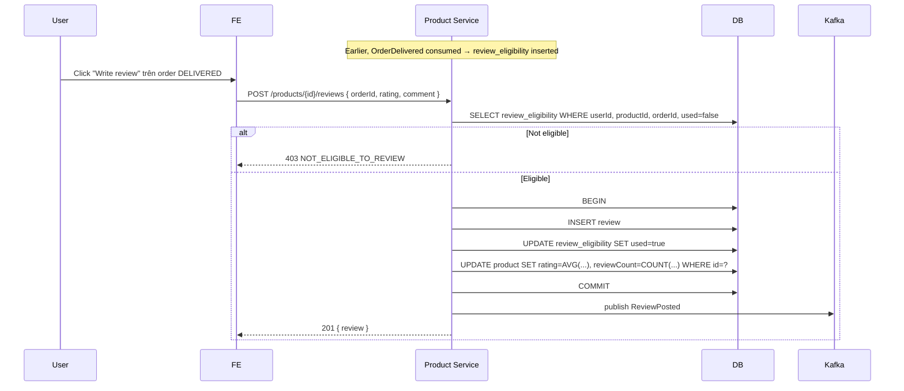

# TS-PRODUCT-REVIEW: Review & Rating

## Tóm tắt
Impl spec cho UC-PRODUCT-REVIEW. Services: **Product** (reviews table, aggregate), **Order** (publish OrderDelivered event). Review eligibility build từ OrderDelivered consumer. 1 user x 1 product x 1 order unique.

## Context Links
- BA Spec: [../ba/uc-product-review.md](../ba/uc-product-review.md)
- Services affected: ✅ Product | ⬜ User | ✅ Order
- Architecture: [../architecture/services/product-service.md](../architecture/services/product-service.md)

## API Contracts

### GET /api/v1/products/{id}/reviews
Public.

**Query**: page, size, sort

**Response 200**
```json
{
  "summary": { "averageRating": 4.7, "totalReviews": 128, "distribution": {"5":89,"4":26,"3":7,"2":4,"1":2} },
  "data": [
    { "id": "uuid", "rating": 5, "comment": "...", "userMaskedName": "Nguyen V.", "userAvatar": "...", "createdAt": "..." }
  ],
  "meta": { "page": 0, "size": 10, "total": 128 }
}
```

### POST /api/v1/products/{productId}/reviews
Requires auth.

**Request**
```json
{ "orderId": "uuid", "rating": 5, "comment": "..." }
```

**Validation**
- `rating`: 1-5 int required
- `comment`: 0-1000 chars, optional

**Response 201** — Review

**Errors**
- 400 `INVALID_RATING`
- 400 `COMMENT_TOO_LONG`
- 400 `ALREADY_REVIEWED`
- 403 `NOT_ELIGIBLE_TO_REVIEW`

### PATCH /api/v1/reviews/{id}
Requires auth (owner).

**Request**: same body

**Response 200**

**Errors**: 403 FORBIDDEN, 403 REVIEW_EDIT_EXPIRED (>24h)

### GET /api/v1/users/me/reviews
Requires auth. List reviews user posted + pending (purchased but not reviewed).

**Response 200**
```json
{
  "posted": [ { review with product info } ],
  "pending": [ { productId, orderId, productName, productImage, deliveredAt } ]
}
```

## Database Changes

### Migration V2__create_reviews.sql (Product DB)
```sql
CREATE TABLE review (
    id UUID PRIMARY KEY,
    product_id UUID NOT NULL REFERENCES product(id),
    user_id UUID NOT NULL,
    order_id UUID NOT NULL,
    rating INT NOT NULL CHECK (rating BETWEEN 1 AND 5),
    comment TEXT,
    is_hidden BOOLEAN DEFAULT false,
    created_at TIMESTAMP NOT NULL DEFAULT now(),
    updated_at TIMESTAMP NOT NULL DEFAULT now(),
    UNIQUE (user_id, product_id, order_id)
);
CREATE INDEX idx_review_product ON review(product_id, is_hidden);
CREATE INDEX idx_review_user ON review(user_id);

CREATE TABLE review_eligibility (
    user_id UUID,
    product_id UUID,
    order_id UUID,
    eligible_at TIMESTAMP NOT NULL,
    used BOOLEAN DEFAULT false,
    PRIMARY KEY (user_id, product_id, order_id)
);
CREATE INDEX idx_review_eligibility_user ON review_eligibility(user_id, used);
```

## Event Contracts

### Consume: order.order.delivered (Order → Product)
Product Service listener `OrderDeliveredHandler`:
```java
@KafkaListener(topics = "order.order.delivered", groupId = "product-service")
public void handle(OrderDeliveredEvent event) {
    for (OrderItem item : event.items) {
        reviewEligibilityRepo.upsert(event.userId, item.productId, event.orderId, event.deliveredAt);
    }
}
```

### Publish: product.review.posted
```json
{ "reviewId": "uuid", "productId": "uuid", "userId": "uuid", "rating": 5, "postedAt": "..." }
```

## Sequence



## Class/Component Design

### Backend — Product Service
```java
@RestController
@RequestMapping("/api/v1/products/{productId}/reviews")
public class ReviewController {
    @GetMapping public ReviewListResponse listForProduct(...);
    @PostMapping public ReviewResponse post(...);
}

@RestController
@RequestMapping("/api/v1/reviews")
public class ReviewEditController {
    @PatchMapping("/{id}") public ReviewResponse edit(...);
}

@RestController
@RequestMapping("/api/v1/users/me/reviews")
public class MyReviewController {
    @GetMapping public MyReviewsResponse getMine(@AuthenticationPrincipal UserPrincipal principal);
}

@Service
public class ReviewService {
    public Review post(UUID userId, UUID productId, PostReviewRequest req);
    public Review edit(UUID userId, UUID reviewId, EditReviewRequest req);
    public ReviewListResponse listForProduct(UUID productId, Pageable pageable);
    public MyReviewsResponse getForUser(UUID userId);

    private void recomputeProductAggregate(UUID productId); // transactional
}

@Service
public class ReviewEligibilityService {
    public boolean isEligible(UUID userId, UUID productId, UUID orderId);
    public void markUsed(UUID userId, UUID productId, UUID orderId);
    public void registerFromOrder(UUID userId, UUID orderId, List<UUID> productIds, Instant deliveredAt);
}

@Component
public class OrderDeliveredListener {
    @KafkaListener(...) public void handle(OrderDeliveredEvent event);
}
```

### Frontend
- Pages: `/account/reviews`
- Components:
  - `ReviewList.tsx` (product detail tab)
  - `RatingStars.tsx`
  - `RatingDistribution.tsx` (bars)
  - `WriteReviewModal.tsx`
  - `MyReviewsList.tsx`
- API: `lib/api/review.api.ts`

## Implementation Steps

### Backend — Product Service
1. [ ] Migration V2__create_reviews.sql
2. [ ] Entities: `Review`, `ReviewEligibility`
3. [ ] Repositories
4. [ ] `ReviewEligibilityService` (check + markUsed + register)
5. [ ] `ReviewService.post` (transactional: insert + eligibility update + aggregate recompute + publish event)
6. [ ] `ReviewService.edit` (24h window check)
7. [ ] `ReviewService.listForProduct` with masking userName
8. [ ] `OrderDeliveredListener` (Kafka consumer)
9. [ ] Controllers
10. [ ] Async aggregate recompute (`@Async` method nếu performance issue)
11. [ ] Unit tests
12. [ ] Integration tests: full flow (simulate OrderDelivered → post review)

### Backend — Order Service
1. [ ] Đảm bảo OrderService publish `OrderDelivered` event với payload đầy đủ: `userId, orderId, items[productId], deliveredAt`

### Frontend
1. [ ] Types `types/review.ts`
2. [ ] API client
3. [ ] `ReviewList` component trong product detail tab
4. [ ] `RatingStars` + `RatingDistribution`
5. [ ] `WriteReviewModal` với form HForm + Zod (rating required 1-5, comment max 1000)
6. [ ] Integration vào order detail page (button "Viết đánh giá" per item)
7. [ ] `/account/reviews` page (posted + pending tabs)
8. [ ] Unit test
9. [ ] E2E: deliver order (admin) → user writes review → displays on product page

## Test Strategy
- Unit (BE): ReviewService post flow, eligibility check, aggregate recompute math
- Integration: Kafka consumer → eligibility → post → aggregate updated
- E2E: complete flow from admin mark delivered to customer review visible public

## Edge Cases
1. **Race: 2 review same eligibility**: DB unique constraint `(user_id, product_id, order_id)` + transaction.
2. **Eligibility not yet registered (Kafka lag)**: user thấy order DELIVERED nhưng chưa review được. Show banner "Đang cập nhật, thử lại sau vài giây." Backlog: retry from FE.
3. **Aggregate recompute heavy**: if product has 100k reviews, AVG() slow. Solution: maintain denormalized `rating_sum` + `review_count`, compute on post/edit delta (not full recompute).
4. **Edit changes rating**: adjust aggregate: subtract old rating, add new. Handle in transaction.
5. **Admin hide review**: exclude from aggregate. Recompute on hide/unhide.
6. **Order CANCELLED before review posted**: eligibility not granted (only OrderDelivered triggers). If already posted → keep (user actually owned + received).
7. **User deleted**: review still shows with masked name (BR privacy). Backlog: GDPR erase → anonymize.
8. **Comment XSS**: sanitize khi render FE (use React default escape + DOMPurify nếu render markdown). BE validate no script tags (optional).
9. **Spam reviews**: backlog — rate limit 1 review/user/10 minutes, flag suspect.
10. **Image in review**: backlog phase 2.
