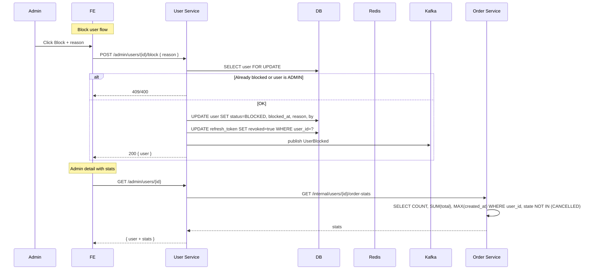

# TS-ADMIN-USER: Admin User Management

## Tóm tắt
Impl spec cho UC-ADMIN-USER. Service: **User** only (list/detail/block/unblock). Optional cross-service call Order Service để get stats (total orders, spending).

## Context Links
- BA Spec: [../ba/uc-admin-user.md](../ba/uc-admin-user.md)
- Services affected: ✅ User | ✅ Order (for stats) | ⬜ Product
- Architecture: [../architecture/services/user-service.md](../architecture/services/user-service.md)

## API Contracts

### GET /api/v1/admin/users
Admin only.

**Query**: page, size, status, role, q (email/name/phone search), dateFrom, dateTo, sort

**Response 200**
```json
{
  "data": [
    { "id": "uuid", "email": "...", "fullName": "...", "phone": "...", "role": "CUSTOMER", "status": "ACTIVE", "createdAt": "..." }
  ],
  "meta": { "page": 0, "size": 20, "total": 1234 },
  "counts": { "ACTIVE": 1200, "BLOCKED": 34 }
}
```

### GET /api/v1/admin/users/{id}
**Response 200**
```json
{
  "id": "...", "email": "...", "fullName": "...", "phone": "...",
  "avatarUrl": "...", "role": "CUSTOMER", "status": "ACTIVE",
  "blockedReason": null, "blockedBy": null, "blockedAt": null,
  "addresses": [...],
  "createdAt": "...", "updatedAt": "...",
  "stats": {
    "totalOrders": 15,
    "totalSpent": 42500000,
    "lastOrderAt": "2026-04-10T..."
  }
}
```
**Note**: `stats` fetched from Order Service via internal API.

### POST /api/v1/admin/users/{id}/block
**Request**: `{ "reason": "required" }`
**Response 200** — user
**Side effect**: revoke all refresh tokens of user. Publish `UserBlocked`.

### POST /api/v1/admin/users/{id}/unblock
**Request**: `{ "reason"? }`
**Response 200** — user
**Side effect**: Publish `UserUnblocked`.

## Internal API (Order Service → User Service side needs... reverse)

User Service calls Order Service:
```
GET /api/v1/internal/users/{userId}/order-stats
Response: { totalOrders, totalSpent, lastOrderAt }
```
Implemented in Order Service.

## Database Changes
(No — uses tables from TS-AUTH)

## Event Contracts

### Publish: user.user.blocked
```json
{
  "eventId": "...", "eventType": "UserBlocked", "version": "1.0", "occurredAt": "...",
  "data": { "userId": "...", "reason": "...", "blockedBy": "...", "blockedAt": "..." }
}
```

### Publish: user.user.unblocked
```json
{ "userId": "...", "unblockedBy": "...", "unblockedAt": "..." }
```

### Consume
None.

## Sequence



## Class/Component Design

### Backend — User Service
```java
@RestController
@RequestMapping("/api/v1/admin/users")
@PreAuthorize("hasRole('ADMIN')")
public class AdminUserController {
    @GetMapping public AdminUserListResponse list(...);
    @GetMapping("/{id}") public AdminUserDetailResponse get(...);
    @PostMapping("/{id}/block") public AdminUserDetailResponse block(...);
    @PostMapping("/{id}/unblock") public AdminUserDetailResponse unblock(...);
}

@Service
public class AdminUserService {
    public Page<UserAdminSummary> list(UserAdminListQuery query);
    public UserAdminDetail getDetail(UUID userId);
    public User block(UUID userId, UUID adminId, String reason);
    public User unblock(UUID userId, UUID adminId, String reason);
}

@Component
public class OrderServiceClient {
    public OrderStats getStats(UUID userId);
}
```

### Backend — Order Service (internal endpoint)
```java
@RestController
@RequestMapping("/api/v1/internal/users")
public class InternalUserOrderController {
    @GetMapping("/{userId}/order-stats")
    public OrderStatsResponse getStats(@PathVariable UUID userId);
}

// Query:
// SELECT COUNT(*) as totalOrders,
//        COALESCE(SUM(total), 0) as totalSpent,
//        MAX(created_at) as lastOrderAt
// FROM "order"
// WHERE user_id = ? AND state NOT IN ('CANCELLED', 'REFUNDED')
```

### Frontend (Admin)
- Pages:
  - `/admin/users` — list
  - `/admin/users/{id}` — detail
- Components:
  - `AdminUserTable.tsx`
  - `UserFilterBar.tsx`
  - `UserStatusBadge.tsx`
  - `BlockUserModal.tsx` (reason required)
  - `UnblockUserModal.tsx`
  - `UserStatsCard.tsx`
- API: `lib/api/admin-user.api.ts`

## Implementation Steps

### Backend — User Service
1. [ ] `AdminUserService` CRUD read + block/unblock
2. [ ] `AdminUserController`
3. [ ] Check: cannot block ADMIN, cannot self-block (currentAdminId != targetUserId)
4. [ ] Block action atomic: update + revoke tokens + publish event in transaction
5. [ ] `OrderServiceClient` for stats
6. [ ] Counts per status (cached 60s)
7. [ ] Unit tests
8. [ ] Integration test: block user → verify refresh tokens revoked + event published

### Backend — Order Service
1. [ ] `InternalUserOrderController.getStats`
2. [ ] Query optimized (index on user_id + state)

### Frontend
1. [ ] Admin user types
2. [ ] API client
3. [ ] User table với filter
4. [ ] User detail page với stats card
5. [ ] Block/unblock modals
6. [ ] E2E: admin block user → logout user (separate session) → user cannot login

## Test Strategy

### Unit
- Cannot block ADMIN, self-block
- Block revokes tokens

### Integration
- Block → user cannot login after token expires (1h) OR immediate if access validated via refresh
- Unblock → user can login
- Stats query returns correct totals (exclude CANCELLED)

### E2E
- Admin blocks user
- Blocked user session: call API returns 401 after access expires
- Blocked user tries login → USER_BLOCKED error

## Edge Cases

1. **Access token still valid after block**: MVP accept 1h window (access token không verified against DB). Phase 2: access token blacklist (jti claim + Redis) for immediate revoke.
2. **Block admin via API**: service check role != ADMIN → 400 CANNOT_BLOCK_ADMIN.
3. **Self-block**: service check targetId != actorAdminId → 400 CANNOT_BLOCK_SELF.
4. **Order Service down during detail fetch**: gracefully degrade — return user without stats, UI shows "Stats unavailable".
5. **Stats stale**: cache 60s at Order Service level. Acceptable for admin dashboard.
6. **Block idempotent**: calling block on already-BLOCKED → 409 or noop 200 với current state. Consistent either way; MVP: 409 for clarity.
7. **Bulk block** (backlog): multiple users. Loop transaction.
8. **Deleted user via DB** (future GDPR): out of MVP scope. Currently not allowed.
9. **Consumer of UserBlocked**: Order Service consume phase 2 to cancel pending orders of blocked user. MVP: skip.
10. **Admin activity audit**: who blocked whom. Currently in user row (blockedBy). Phase 2: separate `admin_audit_log` table.
