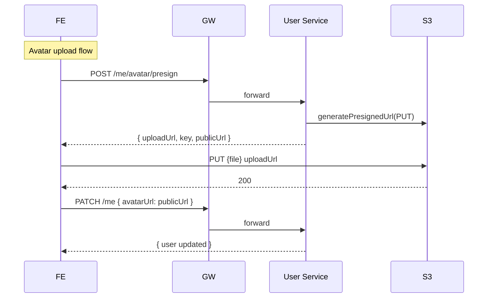

# TS-USER-PROFILE: Hồ sơ & Sổ địa chỉ

## Tóm tắt
Impl spec cho UC-USER-PROFILE. Service: **User** only. Endpoints: GET/PATCH /users/me, POST /me/password, CRUD /me/addresses, presigned URL upload avatar.

## Context Links
- BA Spec: [../ba/uc-user-profile.md](../ba/uc-user-profile.md)
- Services affected: ✅ User | ⬜ Product | ⬜ Order
- Architecture: [../architecture/services/user-service.md](../architecture/services/user-service.md)

## Services & Responsibilities
- **User Service**: all
- **S3**: avatar storage (presigned URL)

## API Contracts

### GET /api/v1/users/me
(Đã cover trong TS-AUTH)

### PATCH /api/v1/users/me
Requires auth.

**Request** (all fields optional)
```json
{ "fullName": "...", "phone": "...", "avatarUrl": "https://..." }
```

**Validation**
- `fullName`: 2-100 nếu có
- `phone`: VN format regex nếu có
- `avatarUrl`: HTTPS URL, hostname match CDN allowlist

**Response 200** — updated UserResponse

**Errors**: 400 INVALID_NAME, INVALID_PHONE, INVALID_AVATAR_URL

---

### POST /api/v1/users/me/password
Requires auth.

**Request**
```json
{ "currentPassword": "...", "newPassword": "..." }
```

**Response 200** — `{ message: "Password changed. Please login again." }`
Side effect: revoke all refresh tokens of user.

**Errors**: 400 WRONG_CURRENT_PASSWORD, WEAK_PASSWORD, SAME_PASSWORD

---

### POST /api/v1/users/me/avatar/presign
Requires auth.

**Request**
```json
{ "filename": "avatar.jpg", "contentType": "image/jpeg", "size": 1048576 }
```

**Validation**
- `contentType`: in [image/jpeg, image/png, image/webp]
- `size`: <= 2097152 (2MB)

**Response 200**
```json
{
  "uploadUrl": "https://s3.amazonaws.com/...?X-Amz-Signature=...",
  "method": "PUT",
  "fields": {},
  "key": "users/{userId}/avatar/{uuid}.jpg",
  "publicUrl": "https://cdn.techstore.com/users/{userId}/avatar/{uuid}.jpg",
  "expiresInSec": 600
}
```

---

### GET /api/v1/users/me/addresses
**Response 200**
```json
{
  "data": [
    { "id": "uuid", "recipientName": "...", "phone": "...", "addressLine1": "...", "ward": "...", "district": "...", "city": "...", "isDefault": true, "createdAt": "..." }
  ]
}
```

### POST /api/v1/users/me/addresses
**Request**
```json
{
  "recipientName": "Nguyen Van A",
  "phone": "0901234567",
  "addressLine1": "123 Le Loi",
  "ward": "Ben Thanh",
  "district": "Quan 1",
  "city": "HCM",
  "isDefault": false
}
```

**Response 201** — Address

**Errors**: 400 ADDRESS_LIMIT_EXCEEDED, INVALID_PHONE, ...

### PATCH /api/v1/users/me/addresses/{id}
Same body as POST, all fields optional. **Response 200** — Address.

### DELETE /api/v1/users/me/addresses/{id}
**Response 204**. Side effect: if deleted was default → promote first remaining as default.

### PUT /api/v1/users/me/addresses/{id}/default
**Response 200** — Address list.

## Database Changes

### Migration V2__create_address.sql
```sql
CREATE TABLE address (
    id UUID PRIMARY KEY,
    user_id UUID NOT NULL REFERENCES user(id),
    recipient_name VARCHAR(100) NOT NULL,
    phone VARCHAR(20) NOT NULL,
    address_line1 VARCHAR(255) NOT NULL,
    ward VARCHAR(100),
    district VARCHAR(100) NOT NULL,
    city VARCHAR(100) NOT NULL,
    is_default BOOLEAN NOT NULL DEFAULT false,
    created_at TIMESTAMP NOT NULL DEFAULT now()
);
CREATE INDEX idx_address_user ON address(user_id);
```

## Event Contracts
None (profile updates don't need events for MVP).

## Sequence



## Class/Component Design

### Backend — User Service
```java
@RestController
@RequestMapping("/api/v1/users/me")
public class UserMeController {
    @GetMapping public UserResponse getMe(...)
    @PatchMapping public UserResponse updateMe(...)
    @PostMapping("/password") public MessageResponse changePassword(...)
    @PostMapping("/avatar/presign") public PresignResponse presignAvatar(...)
    @GetMapping("/addresses") public AddressListResponse getAddresses(...)
    @PostMapping("/addresses") public AddressResponse createAddress(...)
    @PatchMapping("/addresses/{id}") public AddressResponse updateAddress(...)
    @DeleteMapping("/addresses/{id}") public ResponseEntity<Void> deleteAddress(...)
    @PutMapping("/addresses/{id}/default") public AddressListResponse setDefault(...)
}

@Service
public class UserService {
    public User getById(UUID userId);
    public User updateProfile(UUID userId, UpdateProfileRequest req);
    public void changePassword(UUID userId, String current, String newPw);
}

@Service
public class AddressService {
    public List<Address> listByUser(UUID userId);
    public Address create(UUID userId, CreateAddressRequest req);
    public Address update(UUID userId, UUID addressId, UpdateAddressRequest req);
    public void delete(UUID userId, UUID addressId);
    public List<Address> setDefault(UUID userId, UUID addressId);
}

@Service
public class S3PresignService {
    public PresignResponse presignUpload(UUID userId, String filename, String contentType, long size);
}
```

### Frontend
- Pages: `/account/profile`, `/account/profile/password`, `/account/addresses`
- Components: `ProfileForm.tsx`, `ChangePasswordForm.tsx`, `AddressList.tsx`, `AddressFormModal.tsx`, `AvatarUpload.tsx`
- API: `lib/api/user.api.ts`

## Implementation Steps

### Backend
1. [ ] Migration V2__create_address.sql
2. [ ] Entity `Address`
3. [ ] `AddressRepository`
4. [ ] `UserService.updateProfile`, `.changePassword`
5. [ ] `AddressService` CRUD + setDefault (with unique-default logic)
6. [ ] `S3PresignService` (AWS SDK V2)
7. [ ] `UserMeController` + DTOs
8. [ ] Unit tests (AddressService, UserService)
9. [ ] Integration test CRUD address + setDefault logic
10. [ ] `mvn spotless:apply && mvn test`

### Frontend
1. [ ] Types `types/user.ts`, `types/address.ts`
2. [ ] API client `lib/api/user.api.ts`
3. [ ] Zustand update authStore with `user` state
4. [ ] `ProfileForm.tsx`
5. [ ] `AvatarUpload.tsx` — upload direct to S3
6. [ ] `ChangePasswordForm.tsx`
7. [ ] `AddressList.tsx` + `AddressFormModal.tsx`
8. [ ] Page `/account/profile`, `/account/addresses`
9. [ ] E2E test: update profile, add address, set default, delete
10. [ ] `npm run lint && npm test`

## Test Strategy
- Unit: AddressService default-logic (exactly 1 default, delete default promotes next)
- Integration: full CRUD + default logic
- E2E: user flow

## Edge Cases
1. **Concurrent setDefault**: race có thể tạo 2 default. Solution: transaction UPDATE address SET isDefault = (id = :target) WHERE userId = :uid.
2. **Delete default last**: nếu còn 0 address → OK. Nếu còn khác → promote first by createdAt asc.
3. **Update avatar_url với URL không thuộc CDN**: reject (security — prevent malicious URL).
4. **Change password invalidate current session?**: yes, revoke all refresh tokens. User must re-login.
5. **Max 5 address**: check BEFORE insert (SELECT COUNT + INSERT trong cùng transaction với SERIALIZABLE hoặc retry).
